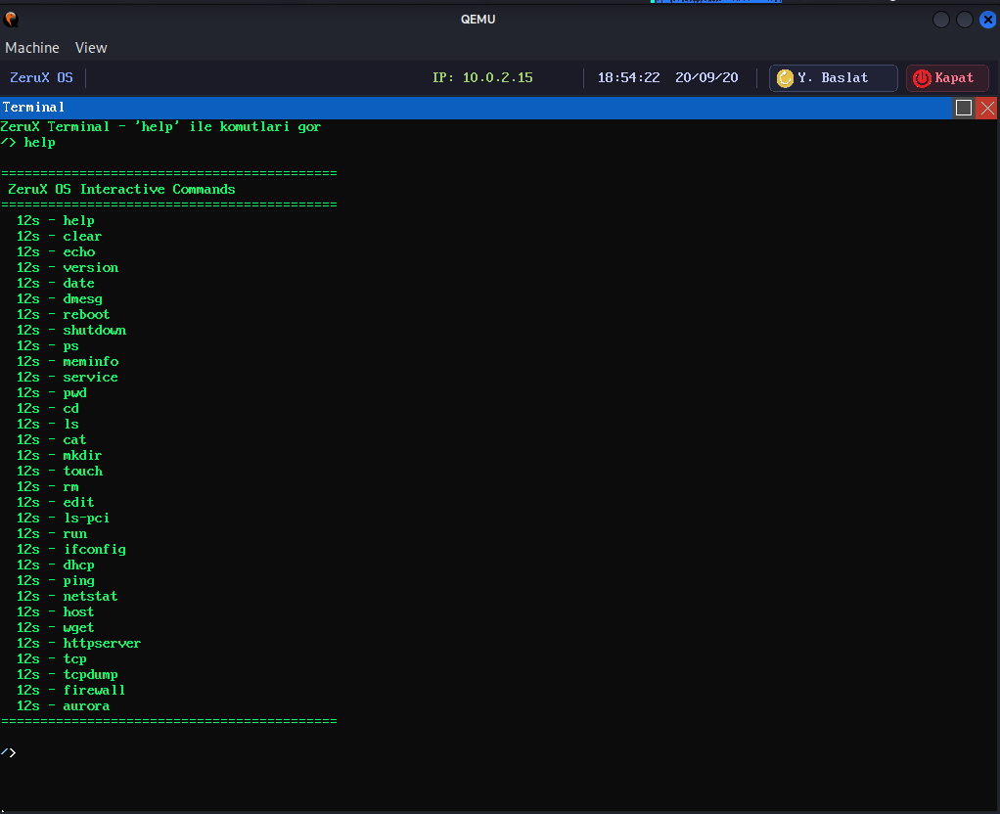

# ZeruX OS

**Sıfırdan yazılmış, 32-bit x86 korumalı mod işletim sistemi.**
Kendi bootloader'ı, bellek yöneticisi, önleyici zamanlayıcısı, TCP/IP yığını, pencere yöneticisi ve web tarayıcısı ile birlikte.


-orange)


---

## İçindekiler

- [Proje Hakkında](#proje-hakkında)
- [Ekran Görüntüleri](#ekran-görüntüleri)
- [Özellik Matrisi](#özellik-matrisi)
- [Mimari Genel Bakış](#mimari-genel-bakış)
- [1. Boot Zinciri](#1-boot-zinciri)
- [2. Bellek Yönetimi](#2-bellek-yönetimi)
- [3. CPU Koruma Altyapısı](#3-cpu-koruma-altyapısı)
- [4. İşlem Yönetimi ve Zamanlayıcı](#4-işlem-yönetimi-ve-zamanlayıcı)
- [5. Ring 3 Geçişi ve ELF Yükleme](#5-ring-3-geçişi-ve-elf-yükleme)
- [6. Sistem Çağrıları ve ZXAPI](#6-sistem-çağrıları-ve-zxapi)
- [7. Dosya Sistemi Mimarisi](#7-dosya-sistemi-mimarisi)
- [8. Ağ Yığını](#8-ağ-yığını)
- [9. Grafik Altyapısı](#9-grafik-altyapısı)
- [10. Sürücüler](#10-sürücüler)
- [11. Shell](#11-shell)
- [12. Aurora Tarayıcı Motoru](#12-aurora-tarayıcı-motoru)
- [13. FTP İstemci ve Sunucu](#13-ftp-istemci-ve-sunucu)
- [14. WebOS – Tarayıcıdan Uzaktan Masaüstü](#14-webos--tarayıcıdan-uzaktan-masaüstü)
- [15. Test ve Doğrulama Altyapısı](#15-test-ve-doğrulama-altyapısı)
- [Derleme ve Çalıştırma](#derleme-ve-çalıştırma)
- [Proje Ağacı](#proje-ağacı)
- [Bilinen Sınırlamalar](#bilinen-sınırlamalar)
- [Yol Haritası](#yol-haritası)
- [Lisans](#lisans)

---

## Proje Hakkında

ZeruX OS, hiçbir mevcut çekirdeğe (Linux, BSD, Minix) dayanmayan, tamamen sıfırdan yazılmış bağımsız bir işletim sistemidir. BIOS'un MBR'yi yüklediği andan grafik masaüstünde bir web sayfası açılana kadar olan zincirdeki **her satır bu depoda** bulunur: gerçek mod bootloader, protected mode geçişi, sayfalama, kesme tablosu, ELF yükleyici, FAT32 sürücüsü, TCP durum makinesi, PNG çözücü, kompozitör ve HTML ayrıştırıcı dahil.

Amaç bir üretim sistemi değil; işletim sistemi kavramlarının **çalışan, gözlemlenebilir ve okunabilir** bir uygulamasını ortaya koymaktır. Bu yüzden kod boyunca yoğun Türkçe/İngilizce yorum, çekirdek içine gömülü doğrulama testleri ve her alt sistemin kendini seri porta raporlaması vardır.

**Öne çıkan yönler:**

- **Gerçek bir TCP durum makinesi** — 11 durum, tıkanıklık penceresi, hızlı yeniden iletim, yeniden iletim kuyruğu, sıra dışı paket kuyruğu, keep-alive ve TIME_WAIT temizliği
- **Kirli dikdörtgen (dirty rect) izleyen kompozitör** — hiçbir şey değişmediyse VRAM'e tek bayt bile yazılmaz
- **Windows NT'den ilham alan nesne yöneticisi** — referans sayımlı, tip güvenli handle tablosu
- **Kendi yazdığı tarayıcı** (Aurora) — DOM ağacı, 45 etiketli HTML ayrıştırıcı, blok/satır içi layout motoru
- **Tarayıcıdan erişilebilen WebOS** — REST API + WebSocket üzerinden gerçek kernel konsolu
- **Otomatik uygulama keşfi** — `user_apps/bin/` içine bir `.c` dosyası bırak, `make` çalıştır, komut shell'de hazır

---

## 📸 Ekran Görüntüleri

### 1. Terminal


Etkileşimli komut satırı arayüzü. `help` komutu çıktısında görülebildiği üzere dosya yönetimi (`ls`, `cd`, `mkdir`, `rm`), ağ araçları (`ping`, `ifconfig`, `wget`, `tcpdump`) ve sistem yönetimi komutlarını sunar.

---

### 2. Dosya Yöneticisi


İşletim sisteminin kök dizin yapısını (`/run`, `/cfg`, `/app`, `/user`, `/core`, `/disk`, `/wire`, `/live`) listeleyen grafiksel dosya yöneticisi.

---

### 3. Güvenlik Duvarı - Mevcut Kurallar


Mevcut paket filtreleme kurallarının eylem (`DROP`), yön (`IN`), protokol (`TCP`), hedef IP/CIDR ve port detaylarıyla birlikte listelendiği yönetim ekranı.

---

### 4. Güvenlik Duvarı - Kural Ekleme Formu


Kaynak IP, MAC, Ağ Maskesi, Port aralığı, Protokol (ANY/ICMP/TCP/UDP) ve Yön (Gelen/Giden) kriterlerine göre yeni trafik engelleme veya izin verme kurallarının tanımlandığı arayüz.

---

### 5. Aurora Tarayıcı - Ana Ekran


ZeruX OS üzerinde çalışan, adres çubuğu üzerinden ağ üzerindeki HTTP servislerine (`192.168.1.1:8080` vb.) erişim sağlayan hafif sıklet web tarayıcısı.

---

### 6. Aurora Tarayıcı - Render Testi


Tarayıcının metin biçimlendirme (kalın, eğik, altı/üstü çizili), listeler, kod blokları, renkli arka planlar ve köprü bağlantılarını (links) işleme yeteneğini gösteren test sayfası.


## Özellik Matrisi

| Alan | Durum | Detay |
|---|:---:|---|
| Bootloader | ✅ | 2 aşamalı özel MBR, E820, VESA mod arama |
| Fiziksel Bellek | ✅ | Bitmap ayırıcı, 4 KB sayfa, E820 tabanlı |
| Sanal Bellek | ✅ | 32-bit sayfalama, süreç başına Page Directory |
| Kernel Heap | ✅ | Free-list, splitting + iki yönlü coalescing |
| Kesmeler | ✅ | 256 IDT kapısı, 32 exception, 8259A PIC remap |
| Çoklu Görev | ✅ | Önleyici Round-Robin, 100 Hz, 20 ms dilim |
| Ring 3 | ✅ | GDT DPL=3, TSS, `iret` geçişi, süreç izolasyonu |
| ELF Yükleme | ✅ | ELF32, PT_LOAD, güvenlik doğrulamaları |
| Sistem Çağrıları | ✅ | `int 0x80`, 30+ çağrı, pointer doğrulama |
| Nesne Yöneticisi | ✅ | Referans sayımlı, tip güvenli handle tablosu |
| VFS | ✅ | vnode soyutlaması, mount tablosu, poll/select |
| FAT32 | ✅ | Okuma **ve** yazma, mkdir, create, delete |
| RAM FS | ✅ | `/user` yazılabilir, `/live` procfs, `/wire` devfs |
| Pipe | ✅ | `SYS_PIPE`, VFS düğümü olarak halka tampon |
| Ethernet/ARP/IPv4 | ✅ | Soft-IRQ kuyruğu, ARP cache, ICMP ping |
| TCP | ✅ | Tam durum makinesi, cwnd/ssthresh, retransmit |
| UDP / DHCP / DNS | ✅ | Port listener'ları, DHCP DORA, domain çözümleme |
| Güvenlik Duvarı | ✅ | 64 kural, L2/L3/L4, CIDR, port aralığı, MAC |
| Paket Yakalama | ✅ | 128 paket halka tamponu, Wireshark `.pcap` dışa aktarım |
| HTTP Sunucu | ✅ | Statik dosya + REST API + WebSocket yükseltme |
| Grafik | ✅ | VESA LFB, 3 MB shadow buffer, kirli dikdörtgen |
| Pencere Yöneticisi | ✅ | 16 pencere, z-order, sürükleme, maximize |
| PNG / BMP | ✅ | Sıfırdan DEFLATE (inflate) + PNG chunk çözücü |
| USB | ✅ | UHCI, HID Boot Protocol mouse, PS/2 çakışma çözümü |
| Depolama | ✅ | ATA/IDE PIO, IDENTIFY, sektör okuma/yazma |
| Tarayıcı | ✅ | DOM, HTML parser, layout motoru, HTTP istemci |
| FTP | ✅ | Ring 3 istemci + sunucu |
| SMP / Çok çekirdek | ❌ | Planlanmadı |
| TLS / HTTPS | ❌ | Yol haritasında |
| 64-bit (x86_64) | ❌ | Planlanmadı |

---

## Mimari Genel Bakış

```
┌──────────────────────────────────────────────────────────────────┐
│  RING 3 (Kullanıcı Alanı)                                        │
│  ELF uygulamaları · libc · ZXAPI (zeruxapi.h) · ftp / ftpd / ls   │
└──────────────────────────────┬───────────────────────────────────┘
                     int 0x80  │  EAX=no, EBX/ECX/EDX=arg
┌──────────────────────────────▼───────────────────────────────────┐
│  RING 0 (Çekirdek)                                               │
│                                                                   │
│  ┌──────────┐ ┌──────────┐ ┌──────────┐ ┌──────────┐ ┌─────────┐ │
│  │ Syscall  │ │ Nesne    │ │  Shell   │ │ HTTP/WS  │ │ Aurora  │ │
│  │ Dispatch │ │ Yöneticisi│ │  + Cmd   │ │ Sunucu   │ │ Tarayıcı│ │
│  └────┬─────┘ └────┬─────┘ └────┬─────┘ └────┬─────┘ └────┬────┘ │
│       │            │            │            │            │      │
│  ┌────▼────────────▼────────────▼────────────▼────────────▼────┐ │
│  │  Görev Yönetimi · Zamanlayıcı · Wait Queue · Senkronizasyon │ │
│  └────┬──────────────────────┬──────────────────────┬─────────┘ │
│       │                      │                      │            │
│  ┌────▼─────┐          ┌─────▼──────┐        ┌──────▼─────────┐ │
│  │   VFS    │          │  Ağ Yığını │        │ Grafik / WM    │ │
│  │ rootfs   │          │  TCP · UDP │        │ Kompozitör     │ │
│  │ fat32    │          │  IPv4·ARP  │        │ gfx2d·Surface  │ │
│  │ devfs    │          │  ICMP·DHCP │        │ Dirty Rect     │ │
│  │ procfs   │          │  DNS·FW    │        │ PNG · Font     │ │
│  │ userfs   │          └─────┬──────┘        └──────┬─────────┘ │
│  │ pipe     │                │                      │            │
│  └────┬─────┘                │                      │            │
│       │                      │                      │            │
│  ┌────▼──────────────────────▼──────────────────────▼─────────┐ │
│  │  Bellek: PMM (bitmap) · VMM (paging) · kheap (free-list)   │ │
│  └────┬───────────────────────────────────────────────────────┘ │
│       │                                                          │
│  ┌────▼───────────────────────────────────────────────────────┐ │
│  │  Donanım: GDT·TSS·IDT·ISR·PIC·IRQ                          │ │
│  │  Sürücüler: ATA · PCI · RTL8139/8168 · UHCI · PS2 · VBE    │ │
│  │             PIT · RTC · Serial · Klavye · Mouse            │ │
│  └────────────────────────────────────────────────────────────┘ │
└──────────────────────────────────────────────────────────────────┘
```

---

## 1. Boot Zinciri

### Stage 1 — `bootloader/boot.asm` (512 bayt, MBR)

BIOS bu sektörü `0x7C00`'a yükler ve 16-bit gerçek modda kontrolü devreder.

```
cli → DS/ES/SS=0, SP=0x7C00 → sti
Boot sürücü numarasını (DL) sakla
INT 13h AH=02h ile 4 sektör oku (Sektör 2–5) → 0x0800:0000 = fiziksel 0x8000
jmp 0x0000:0x8000
```

446. bayttan itibaren **gerçek bir MBR partition tablosu** bulunur:

| Bölüm | Tip | Başlangıç LBA | Sektör |
|---|---|---|---|
| 1 | `0x0C` (FAT32 LBA) | 256 | 300 |
| 2–4 | boş | — | — |

Sonda `0xAA55` imzası. Disk okuma hatasında INT 10h ile `'E'` basılıp `hlt` edilir.

### Stage 2 — `bootloader/boot2.asm` (4 sektör, ORG 0x8000)

**1. Boot info yapısını hazırla** — `0x7E00`'daki 32 baytlık `boot_info_t` sıfırlanır.

**2. E820 bellek haritası** — `INT 15h, EAX=0xE820, EDX='SMAP'` ile 24 baytlık kayıtlar `0x9000`'a yazılır. Başarılıysa magic `0x5A455255` ("ZERU"), kayıt sayısı ve pointer `0x7E00`'a konur.

**3. Kernel yükleme** — `INT 13h AH=08h` ile disk geometrisi (SectorsPerTrack, Heads) okunur, ardından CHS döngüsüyle **500 sektör (250 KB)** `0x1000:0000` = fiziksel `0x10000` adresine alınır. Her sektörde ES `0x20` segment ilerletilir, CHS manuel artırılır (sektör → head → cylinder).

**4. VESA/VBE kurulumu** — `AX=0x4F00` ile VBE2 info block `0x9200`'e alınır. `VideoModePtr`'dan mod listesi dolaşılır, her mod için `AX=0x4F01` ile ModeInfoBlock `0x9400`'e çekilir. Fallback zinciri:

```
1024×768×32  →  1024×768×24  →  800×600×32  →  800×600×24
```

Mod filtresi: `attribute & 0x0091 == 0x0091` (desteklenen + grafik + LFB). Bulunan modun `phys_base (0x9428)`, `pitch (0x9410)`, `width (0x9412)`, `height (0x9414)`, `bpp (0x9419)` alanları `boot_info_t`'ye (`0x7E0C`–`0x7E20`) kopyalanır. Sonra `AX=0x4F02, BX=mode|0x4000` (LFB biti) ile mod ayarlanır.

**5. A20 hattı** — Fast A20: port `0x92`, bit 1.

**6. Protected Mode** — Ekran artık grafik modda olduğundan mesajlar **doğrudan COM1'e (`0x3F8`)** basılır. Geçici 3 girdili GDT (Null / Code 0x08 / Data 0x10, base=0, limit=4 GB, 4 KB granularity) `lgdt` ile yüklenir, `CR0.PE=1`, `jmp 0x08:init_pm`.

**7. 32-bit geçiş** — Segmentler `0x10`, `ESP=0x90000`, `rep movsd` ile kernel `0x10000 → 0x100000` (1 MB) taşınır, stack'e `0x7E00` (boot_info pointer) push edilip `jmp 0x08:0x100000`.

### Stage 3 — Çekirdek (`kernel/linker.ld`)

```ld
ENTRY(kernel_main)
. = 0x100000;
.text : { KEEP(*(.entry))  *(.text)  *(.text.*) }
.rodata / .data / .bss (__bss_start .. __bss_end)
/DISCARD/ : { *(.comment) *(.note*) *(.eh_frame*) *(.debug*) }
```

`kernel_main` `__attribute__((section(".entry")))` ile işaretlidir; `.entry` en başa yerleştirildiği için **kernel binary'sinin ilk baytı kernel_main'dir** ve bootloader'ın `jmp 0x100000`'ı tam yerine düşer.

### Disk İmajı Düzeni

```
Sektör 0        boot.bin            (MBR, 512 B)
Sektör 1–4      boot2.bin           (Stage 2)
Sektör 5+       kernel.bin          (ham binary, maks 250 KB)
Sektör 512+     fat32_partition.img (32 MB FAT32 birimi)
```

### Tam Açılış Sırası (`kernel_main`)

```
 1. Ham UART probe ("[KM]" → port 0x3F8)   ← kernel yaşıyor kanıtı
 2. BSS sıfırlama (__bss_start → __bss_end)
 3. klog_init() → serial_init() → ASCII banner
 4. gdt_init() (+ tss_init, ltr)
 5. boot_info_init() → pmm_init() → vmm_init() → kheap_init()
 6. task_init() (PID 0 kernel_main + PID 1 init)
 7. idt_init() → isr_init() → irq_init() (8259A remap)
 8. timer_init(100) → keyboard_init()
 9. scheduler_init() → syscall_init()
10. pci_init() → ata_init()
11. vbe_init() → fb_init() → gui_init() → wm_init()
12. mouse_init() → usb_init() → uhci_init()
13. vfs_init() → rootfs → userfs → devfs → procfs → fat32
14. rtl8168_init() ?: rtl8139_init() → fw_init() → net/udp/tcp/dhcp/dns
15. net_load_config() (DHCP veya statik IP)
16. cpu_sti()                              ← kesmeler burada açılır
17. BOOT.PNG açılış logosu (2 sn)
18. kernel_selftest()
19. shell_init()
20. http_server_run(80)
21. ═══ IDLE LOOP ═══
      her 3 tick : wm_update() → compositor_compose() → vbe_refresh_screen()
      her döngü  : net_poll() → tcp_timer_poll() → hlt
      her 1 sn   : uptime güncelle
      her 5 sn   : klog_flush_to_disk()
```

---

## 2. Bellek Yönetimi

### 2.1 Boot Info ve E820

```c
typedef struct {
    uint32_t magic;          /* 0x5A455255 "ZERU" */
    uint32_t e820_count;
    uint32_t e820_addr;      /* 0x9000 */
    uint32_t vbe_mode, vbe_phys_base, vbe_pitch;
    uint32_t vbe_width, vbe_height, vbe_bpp;
} __attribute__((packed)) boot_info_t;
```

E820 bölge tipleri: `1=Usable`, `2=Reserved`, `3=ACPI Reclaim`, `4=ACPI NVS`, `5=Bad`.

### 2.2 PMM — Bitmap Fiziksel Sayfa Ayırıcı

Sayfa boyutu **4 KB**. Bitmap `uint32_t` dizisi olarak `_kernel_end` adresine, yani kernelin hemen arkasına yerleştirilir.

**Başlatma algoritması:**

1. E820'den en yüksek kullanılabilir fiziksel adres bulunur (4 GB tavanı uygulanır — PAE yok)
2. Tüm bitmap **DOLU (`0xFFFFFFFF`)** işaretlenir
3. E820'de `Usable` olan bölgeler serbest bırakılır
4. İki kritik bölge tekrar kilitlenir:
   - `0x0 – 0x100000` (BIOS, IVT, VGA)
   - `0x100000 – bitmap_end` (kernel kodu + bitmap'in kendisi)

**API:** `pmm_alloc_block()`, `pmm_free_block()`, `pmm_alloc_blocks(n)` (ardışık blok arama), `pmm_free_blocks()`, `pmm_get_total/used/free_blocks()`.

### 2.3 VMM — 32-bit Sayfalama

```
Sanal adres: [ 31..22 PD index ][ 21..12 PT index ][ 11..0 offset ]
Page Directory (1024 PDE) → Page Table (1024 PTE) → 4 KB sayfa
```

**Bayraklar:** `PRESENT(1)`, `WRITABLE(2)`, `USER(4)`, `WRITETHROUGH(8)`, `CACHE_DISABLE(16)`, `ACCESSED(32)`, `DIRTY(64)`.

**Identity mapping:** `0x00000000`'dan toplam kullanılabilir RAM + 1 MB'a kadar (minimum 64 MB) birebir haritalanır. Sanal = fiziksel olduğu için PMM'den dönen ham adreslere (yeni page table'lar dahil) doğrudan erişilebilir.

`CR3` yüklenir, `CR0.PG` (bit 31) ile donanımsal sayfalama açılır. Her `vmm_map_page` sonunda `invlpg` ile TLB girdisi temizlenir.

**Süreç izolasyonu:** `vmm_create_user_dir()` kernel PD'sinin 1024 girdisini kopyalar (kernel alanı paylaşımlı kalır). `vmm_free_dir()` kernel ile aynı olan PDE'leri atlayarak yalnızca kullanıcı frame'lerini ve page table'ları PMM'e iade eder.

### 2.4 Kernel Heap

```c
#define HEAP_MAGIC              0x48454150  /* "HEAP" */
#define HEAP_START_VIRT_ADDR    0x40000000  /* 1 GB */
#define HEAP_INITIAL_SIZE_BYTES (32 * 1024 * 1024)

typedef struct heap_header {
    uint32_t magic;
    uint32_t size;
    uint8_t  is_free;
    uint8_t  padding[7];      /* 8 bayt hizalama */
    struct heap_header *next, *prev;
} heap_header_t;
```

- `kmalloc` — 8 bayt hizalama, **first-fit** tarama, bölme koşulu `size + header + 16`
- `kfree` — magic doğrulaması (bozulma tespiti), ardından **hem sağ hem sol komşu ile birleştirme (coalescing)**
- `kzalloc` — kmalloc + sıfırlama

### 2.5 Sanal Bellek Haritası

| Adres | İçerik |
|---|---|
| `0x00000000 – 0x000FFFFF` | Düşük bellek (rezerve, PMM'de kilitli) |
| `0x00100000` | Çekirdek (`.entry/.text/.rodata/.data/.bss`) |
| `_kernel_end` | PMM bitmap |
| `0x08048000 +` | Kullanıcı ELF yükleme alanı (zorunlu alt sınır) |
| `0x0B000000 +` | Kullanıcı stack'leri (PID başına 8 KB aralık) |
| `0x10000000` | Kullanıcı heap üst limiti (`sbrk`, 128 MB) |
| `0x40000000` | Kernel heap (32 MB) |
| `0xC0000000` | Kullanıcı alanı üst sınırı (syscall doğrulaması) |
| PCI BAR | VESA lineer framebuffer (identity map) |

---

## 3. CPU Koruma Altyapısı

### 3.1 GDT — 6 Tanımlayıcı

| Selector | İçerik | Access | DPL |
|---|---|---|---|
| `0x00` | Null | — | — |
| `0x08` | Kernel Code | `0x9A` | 0 |
| `0x10` | Kernel Data | `0x92` | 0 |
| `0x18` | User Code (RPL3 → **`0x1B`**) | `0xFA` | 3 |
| `0x20` | User Data (RPL3 → **`0x23`**) | `0xF2` | 3 |
| `0x28` | **TSS** | `0x89` | 0 |

Hepsi base=0, limit=`0xFFFFF`, granularity=`0xCF` (4 KB, 32-bit). `gdt_flush` ile `lgdt` + far jump.

### 3.2 TSS

Tek statik `tss_entry_t`; yalnızca `ss0 = 0x10` ve `esp0` kullanılır, `iomap_base = sizeof(tss)` (I/O bitmap yok). `ltr` ile TR ← `0x28`. Doğrulama `str ax` ile yapılır.

**Kritik:** Zamanlayıcı her bağlam değişiminde `tss_set_kernel_stack(next->kernel_stack_top)` çağırır — Ring 3 → Ring 0 geçişinde doğru stack'e düşmek için.

### 3.3 IDT / ISR

256 kapı: **0–31** CPU exception, **32–47** IRQ, **`0x80`** sistem çağrısı.

```c
/* registers_t alan sırası (isr.h) */
ds, edi, esi, ebp, esp, ebx, edx, ecx, eax,
int_no, err_code, eip, cs, eflags, useresp, ss
```

32 exception'ın tam isim tablosu mevcuttur: `#DE #DB NMI #BP #OF #BR #UD #NM #DF #TS #NP #SS #GP #PF #MF #AC #MC #XM #VE` ve Security Exception.

**Ring ayrımı:**

```c
if ((regs->cs & 3) == 3) {
    /* Ring 3 hatası → sadece süreci öldür, sistem ayakta kalsın */
    task_exit(-1); schedule();
} else {
    /* Ring 0 hatası → kernel panic */
    kernel_panic(reason, regs);
}
```

**Kernel panic ekranı:**

- `cli` ile tüm kesmeler kapatılır
- COM1'e tam register dump: EAX–EDI, EIP, CS, EFLAGS (binary), DS/SS/UserESP, CR0
- **Page Fault'ta CR2 okunur ve error code bit bit çözülür**: present/write/user/reserved/instruction-fetch
- VGA'ya kırmızı panik paneli çizilir
- Sonsuz döngüde **klavye LED'leri yanıp söner** (donanımsal yaşam sinyali)

### 3.4 PIC ve IRQ

```
ICW1 (INIT|ICW4) → ICW2 (Master 0x20, Slave 0x28)
                 → ICW3 (Master 0x04, Slave 0x02 cascade)
                 → ICW4 (8086 modu)
Başlangıç maskesi: 0xFF / 0xFF  (tüm hatlar kapalı)
```

Bir sürücü `irq_install_handler()` çağırdığında ilgili hat **otomatik olarak unmask edilir**. Slave'den bir hat açılırsa Master'daki cascade (IRQ2) da otomatik açılır.

`irq_handler` **önce EOI gönderir**, sonra kayıtlı C callback'i çalıştırır (iç içe kesme güvenliği).

**Kullanılan hatlar:** IRQ0 PIT · IRQ1 Klavye · IRQ12 PS/2 Mouse · NIC (PCI) · UHCI.

---

## 4. İşlem Yönetimi ve Zamanlayıcı

### 4.1 Process Control Block

```c
typedef struct task {
    uint32_t          pid, parent_pid;
    char              name[32];
    task_state_t      state;
    uint32_t          priority, time_slice;
    uint32_t          esp, ebp, eip, eflags;
    page_directory_t *page_directory;
    void             *kernel_stack;
    uint32_t          kernel_stack_top;
    uint32_t          wake_tick;
    int32_t           exit_code;
    int32_t           fds[16];
    zx_handle_table_t handle_table;      /* ZXAPI nesne handle'ları */
    uint32_t          heap_start, heap_end;  /* sbrk */
    struct task      *next, *prev;       /* dairesel çift yönlü liste */
} task_t;
```

**Durumlar:** `READY` · `RUNNING` · `SLEEPING` · `WAITING` · `BLOCKED` · `ZOMBIE`

**Kernel stack:** görev başına `kmalloc(16384)` = **16 KB** (Aurora fetch gibi derin çağrı yığınları için büyütülmüş).

### 4.2 Görev Oluşturma

| Görev | PID | Açıklama |
|---|---|---|
| `kernel_main` | 0 | Statik `g_main_task`, stack `0x7000–0x7BDC` |
| `init` | 1 | Sonsuz `task_waitpid(-1)` döngüsü — **zombie toplayıcı** |

**`kthread_create()`** — PCB `kzalloc`, 16 KB stack, tepe 8 bayt hizalanır, ardından **trampoline frame** kurulur:

```c
ctx->eflags = 0x202;              /* IF=1 */
ctx->eip    = (uint32_t)entry_point;
/* edi,esi,ebp,esp,ebx,edx,ecx,eax = 0 */
```

Böylece ilk `switch_to` doğrudan `popad; popfd; ret` ile göreve dalar.

**`user_process_create()`** — Ring 3 için:

- FD'ler: `fds[0]=-10` (stdin), `fds[1]=-11` (stdout), `fds[2]=-12` (stderr), kalanlar `-1`
- Kullanıcı stack'i: `0x0B000000 + pid*8KB`, 1 sayfa, PMM'den alınıp sıfırlanır, `PRESENT|WRITABLE|USER` ile map edilir
- **argc/argv SysV ABI'ye uygun kurulur:** string'ler tepeden aşağı kopyalanır → 4 bayt hizalı `argv[]` dizisi (+NULL) → **16 bayt hizalama** → `push argv` → `push argc`
- Kernel stack'e `enter_usermode(entry, ustack_top)` için C çağrı çerçevesi yerleştirilir

### 4.3 Zamanlayıcı

**Önleyici Round-Robin**, PIT IRQ0'a bağlı (100 Hz = 10 ms tick), zaman dilimi **2 tick = 20 ms**.

```c
void schedule(void) {
    /* Dairesel listede sonraki READY/RUNNING görevi bul */
    tss_set_kernel_stack(next->kernel_stack_top);   /* Ring 3 güvenliği */
    task_set_current(next);
    if (old->page_directory != next->page_directory)
        vmm_switch_page_directory(next->page_directory);  /* CR3 */
    switch_to(old, next);
}
```

Aynı IRQ0 callback'inde **uyku kuyruğu** da işlenir: `WAITING` durumundaki görevlerin `wake_tick`'i geldiyse `READY` yapılır.

**`switch_to` (assembly):**

```asm
pushfd                  ; EFLAGS
pushad                  ; 8 genel register (toplam 36 bayt)
mov eax, [esp + 40]     ; old task_t*
mov edx, [esp + 44]     ; next task_t*
mov [eax + 52], esp     ; old->esp = ESP
mov esp, [edx + 52]     ; ESP = next->esp
popad
popfd
ret                     ; next görevin EIP'sine sıçra
```

### 4.4 Yaşam Döngüsü

| Fonksiyon | Davranış |
|---|---|
| `task_exit(code)` | **Orphan reparenting** (çocukları PID 1'e devret) → ZOMBIE → `schedule()` |
| `task_kill(pid)` | PID ≤ 2 korumalı (kernel/init öldürülemez) |
| `task_sleep_ms(ms)` | `wake_tick` hesapla → WAITING → `schedule()` + `hlt` döngüsü (busy-wait yok) |
| `task_block()` / `task_unblock()` | I/O ve soket beklemeleri (BLOCKED) |
| `task_waitpid(pid)` | `-1` = herhangi bir çocuk; zombie'yi listeden çıkar, `task_destroy()`, exit code dön |
| `task_destroy()` | FD'leri kapat → handle table yok et → `vmm_free_dir()` → kernel stack + PCB `kfree` |

**Wait Queue (`task/wait.c`):** `wait_event_interruptible()` — `pushf; cli` ile atomik kuyruğa ekleme, sonra `task_block()`. `wake_up()` ilk görevi uyandırır. TCP soketlerinde rx/tx/accept kuyrukları bu yapıyı kullanır.

**Senkronizasyon (`task/sync.c`):** `k_mutex_create/lock/unlock`, `k_sem_create/wait/release`, `k_event_create/set/reset/wait` — hepsi kernel nesnesi olarak sarılır.

---

## 5. Ring 3 Geçişi ve ELF Yükleme

### 5.1 Kullanıcı Moduna Geçiş

```asm
enter_usermode_asm:
    mov ax, 0x23        ; User Data Selector
    mov ds, ax  / es / fs / gs

    push dword 0x23     ; SS  (User Data)
    push ecx            ; ESP (User stack top)
    push dword 0x202    ; EFLAGS (IF=1)
    push dword 0x1B     ; CS  (User Code, RPL 3)
    push ebx            ; EIP (entry point)
    iret                ; Ring 3'e düş!
```

Doğrulama testi CS=`0x1B` / DS=`0x23` kontrolü yapar, ardından **kasten Ring 3'te `cli` çalıştırıp `#GP` tetiklenmesini** bekler.

### 5.2 ELF32 Yükleyici

**Doğrulamalar:** magic `0x464C457F` · `ELFCLASS32` · `ELFDATA2LSB` · `EM_386` · `ET_EXEC`

**Güvenlik kontrolleri:**

```c
/* 1. Program header'lar dosya boyutunu aşamaz (64-bit aritmetik = overflow korumalı) */
if ((uint64_t)e_phoff + (uint64_t)e_phnum * e_phentsize > (uint64_t)bytes_read)
    return -1;  /* REJECTED */

/* 2. Yükleme adresi kullanıcı alanında olmalı (privilege escalation koruması) */
if (vaddr < 0x08048000 || (uint64_t)vaddr + memsz > 0xC0000000)
    return -1;  /* REJECTED */
```

**Yükleme:** Her `PT_LOAD` segmenti 4 KB sayfalara bölünür, her sayfa PMM'den alınır, **sıfırlanır (BSS garantisi)**, `p_filesz` kadarı dosyadan kopyalanır, `PRESENT|WRITABLE|USER` ile yeni Page Directory'ye map edilir.

`max_vaddr` üzerinden **kullanıcı heap başlangıcı** (`sbrk` tabanı) 4 KB hizalı hesaplanır. Sonunda `user_process_create()` çağrılır ve yeni PID döner.

### 5.3 `/BIN` Klasörü Mantığı

```
user_apps/bin/*.c
      ↓  user_apps/Makefile (kendi crt0.asm ve linker.ld'si ile)
user_apps/bin/*.elf
      ↓  tools/mkfat32.py — glob() ile OTOMATİK KEŞİF
FAT32 imajında /BIN/ADIN.ELF
      ↓  shell_dispatch fallback
Shell'de doğrudan "adin" yazarak çalıştır
```

`make_83_name()` dosya adını 8.3 formatına çevirir (alfanümerik olmayanları atar, 8 karaktere kırpar). Çakışmada dosya atlanır ve uyarı basılır.

`/BIN` dizini FAT32'de gerçek bir alt dizin olarak (`.` ve `..` girdileriyle) yaratılır.

> **Sonuç:** `user_apps/bin/` içine yeni bir `.c` at, `make` çalıştır — uygulama otomatik olarak sistemde belirir. Hiçbir yerde manuel kayıt gerekmez.

**Mevcut uygulamalar:** `hello`, `merhaba`, `ls`, `cat`, `echo`, `clear`, `testapp`, `ftp`, `ftpd`

### 5.4 `crt0.asm`

```asm
_start:
    pop eax      ; argc  (kernel user stack'e push etmişti)
    pop ebx      ; argv
    push ebx     ; main(argc, argv) SysV sırası
    push eax
    call main
    push eax     ; main dönüşü = exit status
    call exit
```

Kullanıcı ELF'leri `ENTRY(_start)`, `. = 0x08048000` ile linklenir — standart Linux ELF yükleme adresi ve kernel doğrulayıcısının alt sınırıyla birebir uyumlu.

---

## 6. Sistem Çağrıları ve ZXAPI

### 6.1 Çağrı Konvansiyonu

```
int 0x80
EAX = çağrı numarası
EBX = arg1     ECX = arg2     EDX = arg3
Dönüş: EAX
```

IDT gate `0x80`, flag `IDT_FLAGS_USER_INT` (`0xEE`) → **DPL=3**, Ring 3'ten erişilebilir.

**Assembly stub akışı:**

```
dummy err_code + int_no push → pusha → push ds
→ kernel data (0x10) yükle → push esp (registers_t*)
→ syscall_handler_c() → dönüş değerini [esp+32] (pusha EAX slotu)
→ pop ds → ES/FS/GS'i user data (0x23)'e döndür
→ popa → add esp, 8 → iret
```

### 6.2 Sistem Çağrısı Tablosu

| No | İsim | Argümanlar | İşlev |
|---:|---|---|---|
| 1 | `SYS_WRITE` | handle, buf, len | fd 1/2 için doğrudan serial + VGA |
| 2 | `SYS_GETPID` | — | Mevcut PID |
| 3 | `SYS_YIELD` | — | CPU'yu gönüllü bırak |
| 4 | `SYS_SLEEP` | ms | Non-blocking uyku |
| 5 | `SYS_EXIT` | status | ZOMBIE'ye geç |
| 6 | `SYS_SPAWN` | path, argv | `elf32_load_and_exec` |
| 7 | `SYS_WAITPID` | pid | Çocuk bekle + reap |
| 8 | `SYS_OPEN` | path, mode | **handle** döner |
| 9 | `SYS_READ` | handle, buf, len | |
| 10 | `SYS_CLOSE` | handle | |
| 11 | `SYS_READDIR` | fd, index, `dirent*` | |
| 12 | `SYS_PIPE` | `int fds[2]` | |
| 13 | `SYS_SBRK` | increment | Kullanıcı heap büyütme |
| 14–18 | socket/bind/listen/accept/connect | | BSD soket ailesi |
| 19 | `SYS_CREAT` | path | Yalnızca `/disk/fat0/` önekli, alt dizin yasak |
| 20 | `SYS_CLOSE_HANDLE` | handle | Nesne yöneticisi |
| 21–23 | VirtualAlloc / Free / Protect | | Win32-vari bellek API'si |
| 25 | `SYS_THREAD` | action | Thread oluşturma *(stub)* |
| 26 | `SYS_SYNC` | action, ... | Mutex / Semaphore / Event / Wait |
| 27 | `SYS_IPC` | action, ... | SharedMem / Pipe / Event |
| 28 | `SYS_DEVICE_EXT` | handle, code, args | IoControl *(stub)* |
| 29 | `SYS_GUI` | action, ... | CreateWindow → window handle |
| 30 | `SYS_TIME` | mode | Tick / tarih |
| 31 | `SYS_INFO` | mode, buf | Sürüm, bellek, uptime |
| 32 | `SYS_ENV` | — | *(henüz -1)* |

### 6.3 Güvenlik Katmanı

Pointer alan **her** sistem çağrısında iki primitif kullanılır:

```c
/* Adres kullanıcı alanında mı? Her 4 KB sayfa için PDE ve PTE'nin
   hem PRESENT hem USER biti set mi? */
static int is_user_range_valid(page_directory_t *pdir, uint32_t addr, uint32_t len);

/* String uzunluğunu ölçerken HER SAYFA SINIRINDA yeniden doğrula
   (sayfa sınırında biten string ile kernel'e taşmayı engeller) */
static int strnlen_user(page_directory_t *pdir, const char *str, uint32_t max_len);
```

Sınırlar: `0x08048000 ≤ addr` ve `addr + len ≤ 0xC0000000`.
`sys_spawn` ayrıca `argv` dizisini eleman eleman doğrular, 128 argüman sanity limiti uygular.

### 6.4 Nesne Yöneticisi (NT-benzeri Handle Modeli)

```c
/* Nesne tipleri */
ZX_OBJ_FILE · ZX_OBJ_THREAD · ZX_OBJ_MUTEX · ZX_OBJ_EVENT
ZX_OBJ_PIPE · ZX_OBJ_SHARED_MEM · ZX_OBJ_WINDOW

/* API */
zx_obj_create(type, ptr, ops)
zx_handle_alloc(table, obj)
zx_handle_get(table, id, beklenen_tip)   /* tip güvenli erişim */
zx_obj_deref(obj)                        /* referans sayımı */
zx_handle_close(table, handle)
```

Her görevin kendi `zx_handle_table_t` tablosu vardır. `SYS_OPEN` artık ham fd değil, `FILE` nesnesini saran bir handle döndürür (0/1/2 için legacy fallback korunur).

### 6.5 ZXAPI — Kullanıcı Alanı SDK'sı

Win32 API'sinin kasıtlı bir yeniden yorumu. Tek başlık: `#include "zeruxapi.h"`

```
core/     zx_types.h · zx_error.h · zx_handle.h
memory/   zx_memory.h        → VirtualAlloc/Free/Protect
process/  zx_process.h · zx_thread.h · zx_sync.h
ipc/      zx_pipe.h · zx_event.h · zx_sharedmem.h
io/       zx_io.h · zx_device.h
gui/      zx_window.h · zx_msg.h · zx_graphics.h
network/  zx_network.h · transport/zx_socket.h
system/   zx_system.h · zx_time.h · zx_env.h
```

**Temel tipler:**

```c
typedef uint32_t DWORD, UINT, ULONG, HANDLE, HWND, WPARAM, LPARAM;
typedef uint16_t WORD;   typedef uint8_t BYTE;
typedef int32_t  BOOL, INT, LONG;
typedef char* LPSTR;     typedef const char* LPCSTR;   /* UTF-8 */
#define INVALID_HANDLE_VALUE ((HANDLE)0xFFFFFFFF)
```

**Hata kodları:**

```c
ZX_SUCCESS 0 · NOT_FOUND 2 · PATH_NOT_FOUND 3 · ACCESS_DENIED 5
INVALID_HANDLE 6 · NO_MEMORY 8 · NOT_SUPPORTED 50
INVALID_PARAMETER 87 · IO_DEVICE 1117 · TIMEOUT 1460

DWORD  GetLastError(void);
void   SetLastError(DWORD err_code);
LPCSTR GetErrorString(DWORD err_code);
```

Protokol: kernel negatif kod döndürür (`-6`, `-8`, `-87`), sarmalayıcı `SetLastError((DWORD)(-res))` yapıp `FALSE`/`NULL` döner.

**Bellek API'si:**

```c
void* VirtualAlloc(void* addr, uint32_t size, DWORD alloc_type, DWORD protect);
BOOL  VirtualFree(void* addr, uint32_t size, DWORD free_type);
BOOL  VirtualProtect(void* addr, uint32_t size, DWORD new_protect, DWORD* old_protect);
/* Bayraklar: ZX_MEM_COMMIT 0x1000, ZX_MEM_RESERVE 0x2000,
              ZX_MEM_RELEASE 0x8000, ZX_MEM_DECOMMIT 0x4000
   Koruma:    ZX_MEM_READ/READWRITE/EXECUTE/EXECUTE_READ/EXECUTE_READWRITE */
```

> `int 0x80` yalnızca 3 argüman taşıdığı için `alloc_type` ve `protect` tek DWORD'e paketlenir:
> `flags = (alloc_type << 16) | (protect & 0xFFFF)`

**Süreç / Thread / Senkronizasyon:**

```c
HANDLE CreateProcess(LPCSTR path, LPCSTR args);
BOOL   TerminateProcess(HANDLE process, int exit_code);
DWORD  GetCurrentProcessId(void);
BOOL   WaitForProcess(HANDLE process);
void   ExitProcess(int exit_code);
BOOL   GetProcessInfo(DWORD pid, PROCESS_INFO *info);

HANDLE CreateThread(ZX_THREAD_START_ROUTINE start, void* param,
                    DWORD flags, DWORD* thread_id);
void   ExitThread(DWORD exit_code);
BOOL   SuspendThread(HANDLE t);  BOOL ResumeThread(HANDLE t);
void   Sleep(DWORD ms);          void YieldProcessor(void);

HANDLE CreateMutex(BOOL initial_owner, LPCSTR name);
BOOL   ReleaseMutex(HANDLE mutex);
HANDLE CreateSemaphore(int initial, int max, LPCSTR name);
BOOL   ReleaseSemaphore(HANDLE sem, int count, int* prev);
DWORD  WaitForSingleObject(HANDLE handle, DWORD ms);   /* ZX_INFINITE = 0xFFFFFFFF */
```

`WaitForSingleObject` nesne tipine göre dallanır (`k_mutex_lock` / `k_event_wait` / `k_sem_wait`) — gerçek Win32 davranışı.

**IPC:**

```c
HANDLE CreatePipe(LPCSTR name);
BOOL   ReadPipe / WritePipe(HANDLE, void*, uint32_t, uint32_t* transferred);
HANDLE CreateEvent(BOOL manual_reset, BOOL initial_state, LPCSTR name);
BOOL   SetEvent(HANDLE) / ResetEvent(HANDLE);
HANDLE CreateSharedMemory(LPCSTR name, uint32_t size);
void*  MapSharedMemory(HANDLE);   BOOL UnmapSharedMemory(void*);
```

**Dosya ve Cihaz:**

```c
HANDLE CreateFile(LPCSTR filename, DWORD access, DWORD creation_disposition);
BOOL   ReadFile / WriteFile(HANDLE, void*, DWORD, DWORD* transferred);
DWORD  SetFilePointer(HANDLE file, LONG distance, DWORD move_method);
BOOL   DeleteFile(LPCSTR filename);
/* ZX_CREATE_NEW 1 · CREATE_ALWAYS 2 · OPEN_EXISTING 3 · OPEN_ALWAYS 4 · TRUNCATE 5
   ZX_GENERIC_READ 0x80000000 · ZX_GENERIC_WRITE 0x40000000 */

HANDLE OpenDevice(LPCSTR device_name);
BOOL   DeviceIoControl(HANDLE dev, DWORD code, void* in, DWORD in_sz,
                       void* out, DWORD out_sz, DWORD* returned);
```

**GUI (mesaj sabitleri Win32 ile birebir aynı):**

```c
typedef struct { HWND hwnd; UINT message; WPARAM wParam; LPARAM lParam; DWORD time; } ZX_MSG;

#define ZX_MSG_PAINT       0x000F    #define ZX_MSG_QUIT        0x0012
#define ZX_MSG_KEYDOWN     0x0100    #define ZX_MSG_MOUSEMOVE   0x0200
#define ZX_MSG_LBUTTONDOWN 0x0201    #define ZX_MSG_RBUTTONDOWN 0x0204

HWND   CreateWindowEx(DWORD exStyle, LPCSTR className, LPCSTR windowName, DWORD style,
                      int x, int y, int w, int h, HWND parent,
                      HANDLE menu, HANDLE instance, void* param);
BOOL   ShowWindow(HWND hwnd, int command);
BOOL   GetMessage / PeekMessage / PostMessage(...);
LPARAM DispatchMessage(const ZX_MSG *msg);

HDC    BeginPaint(HWND hwnd, ZX_PAINTSTRUCT *ps);
BOOL   FillRect(HDC hdc, const ZX_RECT *rect, DWORD color);
BOOL   DrawText(HDC hdc, LPCSTR text, int length, ZX_RECT *rect, DWORD format);
```

> 12 argüman `int 0x80`'e sığmadığı için `ZX_CREATE_STRUCT` paketleme yapısı kullanılır.

**Ağ — `ZX_PROTOCOL` eklenti çerçevesi:**

```c
typedef struct {
    const char *name;
    HANDLE (*connect)(LPCSTR host, WORD port);
    BOOL   (*send)(HANDLE ctx, const void* data, DWORD size);
    BOOL   (*recv)(HANDLE ctx, void* buffer, DWORD size);
    BOOL   (*close)(HANDLE ctx);
} ZX_PROTOCOL;
```

Amacı kodda açıkça yazılı: *"HTTP, FTP, MQTT, SMTP vb. bütün yüksek seviye protokoller bu arayüzü uygulayarak sisteme eklenecek — kernel'e dokunmadan yeni protokol ekleme mimarisi."*

```c
HANDLE SocketCreate(DWORD socket_type);     /* ZX_SOCKET_TCP/UDP/TLS */
BOOL   SocketConnect(HANDLE s, LPCSTR ip, WORD port);
BOOL   SocketSend / SocketRecv(HANDLE, void*, DWORD, DWORD* transferred);
BOOL   SocketClose(HANDLE s);
```

**Sistem / Zaman / Ortam:**

```c
BOOL   GetSystemInfo(SYSTEM_INFO *info);    /* kernel_version, total/free mem, uptime */
DWORD  GetTickCount(void);
BOOL   GetSystemTime / GetLocalTime(SYSTEMTIME *t);
LPCSTR GetEnvironmentVariable(LPCSTR name);
BOOL   SetEnvironmentVariable(LPCSTR name, LPCSTR value);
LPCSTR GetCurrentDirectory(void);  BOOL SetCurrentDirectory(LPCSTR path);
LPCSTR GetCommandLine(void);
```

### 6.6 POSIX Benzeri libc

```c
int syscall0/1/2/3/4(...);

int   write(int fd, const void *buf, int count);
int   getpid(void);       void yield(void);      void sleep(int ms);
void  exit(int status);
int   spawn(const char *path, const char **argv);
int   waitpid(int pid);
int   open(const char *path, int flags);
int   read(int fd, void *buf, int count);
int   close(int fd);
struct dirent *readdir(int fd, int index);
int   socket / bind / listen / accept / connect(...);
int   creat_fat0(const char *path);
```

open bayrakları: `O_RDONLY 0x0000` · `O_WRONLY 0x0001` · `O_RDWR 0x0002` · `O_CREAT 0x0100` · `O_TRUNC 0x1000` · `O_APPEND 0x2000`

---

## 7. Dosya Sistemi Mimarisi

### 7.1 VFS Çekirdeği

```c
typedef struct {
    int32_t (*read)(vfs_node_t*, uint32_t offset, uint32_t size, uint8_t *buf);
    int32_t (*write)(vfs_node_t*, uint32_t offset, uint32_t size, const uint8_t *buf);
    void    (*open)(vfs_node_t*);
    void    (*close)(vfs_node_t*);
    struct dirent* (*readdir)(vfs_node_t*, uint32_t index);
    vfs_node_t*    (*finddir)(vfs_node_t*, const char *name);
    int     (*poll)(vfs_node_t*, short events);
} vfs_node_ops_t;

typedef struct vfs_node {
    char             name[128];
    uint32_t         flags, inode, length;
    vfs_node_ops_t  *ops;
    struct vfs_node *ptr;           /* mountpoint hedefi */
    void            *device_data;
} vfs_node_t;
```

**Düğüm tipleri:** `FILE` · `DIRECTORY` · `CHARDEVICE` · `BLOCKDEVICE` · `PIPE` · `MOUNTPOINT`
**Limitler:** 64 global FD · 256 karakter yol · 128 karakter isim

`sys_poll()` ve `sys_select()` (fd_set ile) uygulanmıştır; poll callback'i sürücü seviyesinde çalışır (TCP dahil).

### 7.2 Mount Ağacı

Unix'ten kasten farklı isimlendirme kullanılır:

```
/              rootfs   Statik dizinler: /run /cfg /app /user /core /disk
                        + dinamik mount'ları da aynı listede gösterir
/wire          devfs    serial0 · kbd · null · zero
/live          procfs   tasks · meminfo · version
/user          userfs   RAM tabanlı, YAZILABİLİR (64 düğüm, düğüm başına 4 KB)
/disk/fat0     FAT32    Gerçek disk, okuma + yazma
```

`rootfs_readdir` hem 6 statik dizini hem de `/` altına sonradan mount edilenleri tek listede birleştirir.

### 7.3 FAT32 Sürücüsü

- Birim başlangıcı LBA **512**; BPB okunarak hesaplanır:
  ```
  first_fat_lba  = start + reserved_sector_count
  first_data_lba = first_fat_lba + (num_fats * fat_size_32)
  total_clusters = (total_sectors_32 - data_offset) / sectors_per_cluster
  ```
- **Gerçek okuma + yazma:** `fat32_read_fat_entry` / `fat32_write_fat_entry` (yazarken **FAT2 kopyası da güncellenir**), cluster zinciri takibi, `fat32_create`, `fat32_mkdir`, `fat32_find_entry`, silme
- 8.3 isim dönüşümü çift yönlü, karşılaştırma **büyük/küçük harf duyarsız**
- 64 düğümlük vnode önbelleği; her dosya için `entry_dir_cluster` + `entry_index` saklanır (boyut güncellemesi için)

### 7.4 `mkfat32.py` — İmaj Üretici

32 MB (65.536 sektör) FAT32 düzeni:

```
Sektör    0        VBR / BPB      (OEM "ZERUXOS ", 512 B/sektör, 1 sektör/cluster)
Sektör   32–543    FAT1           (512 sektör)
Sektör  544–1055   FAT2           (512 sektör)
Sektör 1056+       Veri alanı     (cluster 2 = kök dizin)
```

Kök dizine eklenenler: `WELCOME.TXT`, `NOTES.TXT`, `INDEX.HTM`, `STYLE.CSS`, `DESKTOP.JS` ve PNG varlıkları — `WALLPAPR.PNG`, `AURORA.PNG`, `EXPLORER.PNG`, `FIREWALL.PNG`, `TERMINAL.PNG`, `START.PNG`, `BOOT.PNG`, `SHUTDOWN.PNG`, `RESTART.PNG`.

`/BIN` dizinine tüm kullanıcı ELF'leri otomatik eklenir. Disk dolarsa açıklayıcı `RuntimeError` fırlatılır.

---

## 8. Ağ Yığını

### 8.1 Katman Haritası

```
Uygulama   HTTP sunucu/istemci · WebSocket · DNS · DHCP · FTP (Ring 3)
Soket      BSD API: socket/bind/listen/accept/connect/send/recv/close
Taşıma     TCP (tam durum makinesi)  ·  UDP (port listener)
Ağ         IPv4 · ICMP · ARP (cache + resolve)
Bağlantı   Ethernet II
Sürücü     RTL8168/8111 (öncelikli) → RTL8139 (yedek)
Güvenlik   Firewall — L2/L3/L4 kural motoru, IPv4 akışında devrede
```

### 8.2 Ethernet / ARP / IPv4 / ICMP

Tüm başlıklar `#pragma pack(push,1)` ile bit-tam: `eth_hdr_t` (14 B), `arp_hdr_t` (28 B), `ipv4_hdr_t` (20 B), `icmp_hdr_t` (8 B). `htons/ntohs/htonl/ntohl` ve standart 16-bit one's complement checksum kendi implementasyonudur.

**Soft-IRQ mimarisi (önemli tasarım tercihi):**

```
NIC kesmesi → net_receive_packet()
                 ↓  pushf; cli ile atomik kopyalama
           128 girdilik RX ring buffer
                 ↓
Kernel idle loop → net_poll()  ← IRQ BAĞLAMI DIŞINDA
                 ↓
           ARP (0x0806) / IPv4 (0x0800) işleme
```

Böylece uzun protokol işlemleri kesme içinde kilitlenme yaratmaz.

**Paket yakalama:** 128 paketlik `g_pcap_buffer` halka tamponu, her paket zaman damgalı (`PCAP_MAX_LEN 1514`). `/api/net/pcap` üzerinden **gerçek Wireshark uyumlu `.pcap`** dosyası indirilebilir (libpcap global header `0xa1b2c3d4`, per-packet header, Ethernet link tipi).

**İstatistikler:** `rx_packets` · `rx_bytes` · `tx_packets` · `tx_bytes` · `rx_dropped`

### 8.3 TCP

**64 soket** (`MAX_TCP_SOCKETS`), her biri için tam TCB.

**11 durumlu durum makinesi:**

```
                  ┌─────────┐
                  │ CLOSED  │
                  └────┬────┘
          passive open │ active open
        ┌──────────────┴──────────────┐
        ▼                             ▼
   ┌────────┐                   ┌──────────┐
   │ LISTEN │                   │ SYN_SENT │
   └───┬────┘                   └────┬─────┘
       │ SYN alındı                  │ SYN+ACK alındı
       ▼                             │
┌──────────────┐                     │
│ SYN_RECEIVED ├─────────────────────┤
└──────┬───────┘      ACK            │
       └─────────────┬───────────────┘
                     ▼
              ┌─────────────┐
              │ ESTABLISHED │
              └──┬───────┬──┘
     close │     │       │     │ FIN alındı
           ▼     │       │     ▼
   ┌────────────┐│       │┌────────────┐
   │ FIN_WAIT_1 ││       ││ CLOSE_WAIT │
   └──────┬─────┘│       │└──────┬─────┘
          ▼      │       │       ▼
   ┌────────────┐│       │┌────────────┐
   │ FIN_WAIT_2 ││       ││  LAST_ACK  │
   └──────┬─────┘│       │└──────┬─────┘
          ▼      ▼       ▼       ▼
     ┌───────────┐  ┌─────────┐  ┌────────┐
     │ TIME_WAIT │  │ CLOSING │  │ CLOSED │
     └─────┬─────┘  └─────────┘  └────────┘
           │ 5 sn MSL
           └──────────► CLOSED
```

**TCB içeriği:**

| Grup | Alanlar |
|---|---|
| Sıra numaraları | `snd_una` · `snd_nxt` · `rcv_nxt` |
| Akış/tıkanıklık | `window` · `snd_wnd` · **`cwnd`** · **`ssthresh`** · `dup_acks` (Fast Retransmit) |
| Opsiyonlar | `rcv_wscale` / `snd_wscale` (Window Scaling) · `mss` |
| Tamponlar | 8 KB RX + 8 KB TX |
| Kuyruklar | `tx_queue` (yeniden iletim) · **`rx_ooo_queue`** (sıra dışı paketler) |
| Sunucu | `backlog` · 16 girdilik SYN kuyruğu · 16 girdilik accept kuyruğu · `parent_socket` |
| Bekleme | `rx_wait_queue` · `tx_wait_queue` · `accept_wait_queue` |
| Zamanlayıcılar | `rto` · `smoothed_rtt` · `retransmit_deadline` · `last_activity_tick` |

**`tcp_send` davranışı:** Gönderim penceresi `min(snd_wnd, cwnd)` ile sınırlanır, veri **1024 baytlık MSS parçalarına** bölünür, son parçaya `PSH` bayrağı konur, RTO `smoothed_rtt * 2` olarak dinamik hesaplanır. Pencere doluysa `wait_event_interruptible()` ile görev bloklanır (`O_NONBLOCK` destekli).

**`tcp_timer_poll()`** (idle loop'tan sürekli çağrılır) üç iş yapar:

| İş | Davranış |
|---|---|
| **Yeniden iletim** | RTO dolan segmentleri tekrar yollar. **5 deneme sonrası RST + soket imhası.** İlk timeout'ta `ssthresh = cwnd/2` (min 1024), `cwnd = 1024` (slow start'a dönüş), **RTO exponential backoff** (×2, maks 60 sn) |
| **Keep-alive** | ESTABLISHED + 10 sn sessizlikte boş ACK |
| **TIME_WAIT** | 5 sn MSL sonrası soket temizliği |

Checksum, IPv4 pseudo-header (`tcp_pseudo_hdr_t`) ile doğru hesaplanır.

### 8.4 UDP / DHCP / DNS

- **UDP** — port bazlı listener kayıt sistemi: `udp_register_listener(port, callback)`
- **DHCP** — client 68 ↔ server 67, magic cookie `0x63825363`, XID doğrulaması, **DISCOVER → OFFER → REQUEST → ACK** akışı, opsiyon ayrıştırma (IP, mask, gateway, DNS)
- **DNS** — `dns_resolve(hostname, out_ip)`, domain label encoding'i, UDP 53 üzerinden sorgu/yanıt

### 8.5 Ağ Yapılandırması

`/disk/fat0/etc/network/net.cfg` okunur. **Dosya yoksa FAT32 üzerinde `etc/` ve `network/` dizinleri gerçekten yaratılıp** varsayılan içerik yazılır:

```ini
DHCP=1
IP=192.168.50.2
MASK=255.255.255.0
GW=192.168.50.1
DNS=8.8.8.8
```

`DHCP=1` ise `dhcp_discover()` tetiklenir, `DHCP=0` ise statik IP uygulanır.

### 8.6 Güvenlik Duvarı

```c
typedef struct {
    bool           active;
    fw_action_t    action;      /* DROP · ALLOW · LOG */
    fw_direction_t direction;   /* IN · OUT · BOTH */
    uint32_t       src_ip, src_mask;     /* CIDR */
    uint8_t        src_mac[6];
    bool           mac_filter_active;
    uint8_t        protocol;    /* 0=ANY · 1=ICMP · 6=TCP · 17=UDP */
    uint16_t       port_min, port_max;
    char           name[32];
    uint32_t       hit_count;
} fw_rule_t;
```

**64 kural**, varsayılan politika `ALLOW` (değiştirilebilir). İstatistikler: `total_in/out`, `dropped_in/out`, `allowed_in/out`, `logged_count`.

Kolaylık API'leri: `fw_open_port()`, `fw_close_port()`, `fw_block_ip()`, `fw_allow_ip()`, `fw_flush()`.

Yönetim üç kanaldan yapılabilir: **GUI penceresi** (`gui/firewall_app.c`), **shell komutu** (`firewall`), **WebOS REST API'si**.

### 8.7 Ağ Sürücüleri

- **RTL8139** — PCI keşfi, 8 KB+16 RX ring, TX slot rotasyonu, IRQ handler
- **RTL8168/8111** — descriptor tabanlı modern NIC. `rtl8168_init()` başarısız olursa kernel otomatik olarak 8139'a düşer; `net_init()` hangisinin aktif olduğunu raporlar

---

## 9. Grafik Altyapısı

### 9.1 Katmanlı Akış

```
Uygulama pencereleri (terminal · explorer · browser · firewall · taskmgr)
        │  her biri kendi gfx_surface_t içeriğine çizer
        ▼
compositor_compose()   — hasar (damage) hesabı, z-order, duvar kağıdı, taskbar
        ▼
gfx2d                  — surface üzerinde 2D primitifler
        ▼
g_vbe_shadow[1024*768] — 3 MB shadow buffer (BSS'te statik)
        ▼
vbe_refresh_screen() / fb_present()   — SADECE kirli dikdörtgenler
        ▼
VRAM (Lineer Framebuffer, PCI BAR)
```

### 9.2 VBE

Mod bilgisi bootloader'dan `boot_info_t` ile gelir (çalışma anı için BGA portları `0x1CE`/`0x1D0` de tanımlıdır). LFB fiziksel adresi **sayfa sayfa identity map** edilir çünkü genel identity map yalnızca ~64 MB'ı kapsar, BAR0 çok daha yukarıdadır.

**Hızlandırma:** `rep stosl` (`vbe_stosl`) ve `rep movsl` (`vbe_movsl`) inline assembly.

**Primitifler:** `put_pixel` · `fill_rect` · `draw_rect` · **Bresenham** `draw_line` · `draw_char`/`draw_string` (8×16 bitmap font).

**Pitch farkı doğru ele alınır:** shadow buffer `width` stride'ında, VRAM `pitch` stride'ında — satır satır kopyalama yapılır.

### 9.3 Surface Soyutlaması

```c
typedef struct {
    uint32_t *pixels;       /* row-major 32bpp, 0x00RRGGBB */
    uint32_t  width, height, pitch;
    bool      owns_memory;
    int32_t   clip_x, clip_y, clip_w, clip_h;   /* her çizimde uygulanır */
    bool      is_dirty;
    int32_t   dirty_x0, dirty_y0, dirty_x1, dirty_y1;   /* otomatik takip */
} gfx_surface_t;
```

`surface_wrap()` ile sahiplenmeyen görünüm oluşturulur — ekran surface'i shadow buffer'ın üstüne bu şekilde wrap edilir.

### 9.4 gfx2d Çizim Kütüphanesi

| Grup | Fonksiyonlar |
|---|---|
| Temel | `gfx_put_pixel` · `gfx_draw_line` · `gfx_draw_rect` · `gfx_fill_rect` |
| Daire | `gfx_draw_circle` · `gfx_fill_circle` |
| Yuvarlatılmış | `gfx_draw_round_rect` · `gfx_fill_round_rect` |
| Metin | `gfx_draw_char` · `gfx_draw_text` |
| Blit | `gfx_blit` · `gfx_blit_alpha` (sabit alfa harmanlama) |
| Gradyan | `gfx_gradient_rect` (dikey/yatay) |
| Ölçekleme | `gfx_stretch_blit` (nearest-neighbor, FPU'suz) |
| Desen | `gfx_fill_hatched` — GDI tarzı: HORIZONTAL · VERTICAL · FDIAGONAL · BDIAGONAL · CROSS · DIAGCROSS |

### 9.5 Kirli Dikdörtgen Sistemi

- Maksimum **64 ayrık dikdörtgen**; aşılırsa otomatik "tam ekran" moduna düşer
- API: `dirty_mark(x,y,w,h)` · `dirty_mark_all()` · `dirty_is_full_screen()` · `dirty_count()` · `dirty_get(i)` · `dirty_reset()`
- **Mouse imleci kendi hasarını kendi işaretler:** `vbe_refresh_screen()` içinde imlecin hem eski hem yeni 12×18 ayak izi kirli işaretlenir (üst katmanlar imlecin hareketini bilmez)
- **Hiçbir şey değişmemişse VRAM'e tek bayt bile yazılmaz**

### 9.6 Kompozitör

**İki geçişli hasar hesabı:**

1. **Geçiş 1** — Her pencerenin önceki kare snapshot'ı (`g_prev[]`) ile karşılaştırılır. Taşındı/boyutlandı/kirli ise **hem eski hem yeni dikdörtgen** hasara eklenir. Sadece içerik değiştiyse yalnızca içeriğin kendi kirli bölgesi eklenir.
2. **Geçiş 2** — Geçen karede var olup bu karede olmayan (kapatılan) pencerelerin eski alanı hasara eklenir.

Hasar yoksa fonksiyon hiçbir şey yapmadan döner.

**Hasar varsa çizim sırası:**

```
clip ayarla → arka plan rengi (0x1E1E2E)
→ /disk/fat0/WALLPAPR.PNG duvar kağıdı (ortalanmış, clip'e saygılı)
→ masaüstü ikonları (background fazı)
→ z-order'a göre ARKADAN ÖNE pencereler   ← occlusion doğru kalır
→ taskbar (foreground fazı, her zaman üstte)
```

Taskbar ayrıca **RTC saniyesi veya `g_local_ip` değiştiğinde** yeniden çizilir.

**Pencere dekorasyonu:** başlık çubuğu (odaklı `0x0A5FBF` / odaksız `0x707070`), maximize butonu, kırmızı kapatma butonu (X çizgileriyle), 1 px kenarlık.

### 9.7 Pencere Yöneticisi

```c
struct window {
    int32_t  id, x, y, w, h;
    char     title[64];
    gfx_surface_t *content;         /* client alanı: w × (h - 24) */
    bool     visible, focused, dirty, maximized;
    int32_t  orig_x, orig_y, orig_w, orig_h;
    void    *app_data;
    wm_key_handler_t     on_key;
    wm_click_handler_t   on_click;
    wm_destroy_handler_t on_destroy;
    wm_update_handler_t  on_update;   /* kare başına */
    wm_resize_handler_t  on_resize;
};
```

**16 pencere** (`WM_MAX_WINDOWS`), başlık çubuğu 24 px, başlık maks 64 karakter. Z-order ayrı bir dizide tutulur.

**`wm_update()` her karede:**

```
1. desktop_ui_handle_click() denenir (taskbar / ikonlar)
2. Yeni mouse-down ise hit-test:
     kapatma butonu → wm_destroy_window()
     maximize butonu → wm_toggle_maximize()
     başlık çubuğu   → sürükleme başlat (offset sakla)
     içerik alanı    → on_click(pencere-yerel koordinatlar)
3. Sürükleme sürüyorsa → wm_move_window()
4. Klavye: bekleyen tüm karakterler odaklı pencerenin on_key'ine
           (odak yoksa kuyruk yine boşaltılır — tuş birikmesin)
5. Tüm pencerelerin on_update callback'leri
```

`wm_toggle_maximize` eski geometriyi saklar, taskbar yüksekliğini hesaba katar, **content surface'i yeni boyutta yeniden yaratır** ve `on_resize` tetikler.

### 9.8 Görüntü Çözücüler

- **PNG** — sıfırdan yazılmış **DEFLATE/zlib inflate** implementasyonu (`inflate.c`, 261 satır) + PNG chunk ayrıştırma + filter reversal (`png.c`, 259 satır). `png_load(path)` doğrudan VFS'ten okuyup `gfx_surface_t*` döndürür
- **BMP** — `drivers/bmp.c`

### 9.9 Masaüstü Ortamı

**Tokyo Night paleti:**

| Öğe | Renk |
|---|---|
| Taskbar | `0x1A1B26` |
| Taskbar kenarı | `0x24283B` |
| Accent | `0x7AA2F7` |
| Metin | `0xC0CAF5` |
| Sönük metin | `0x565F89` |
| Menü | `0x1F2335` |
| IP yeşili | `0x9ECE6A` |
| Güç kırmızısı | `0xF7768E` |

Masaüstü ikonları 64×64, 96 px dikey aralık: **Tarayıcı · Dosyalar · Terminal · Güvenlik · Görevler**. PNG yüklenemezse **prosedürel yedek ikonlar** çizilir (yuvarlatılmış kutu + renk kodlu rozet: WEB / DIR / `>_` / SEC / CPU). Etiketlerde 1 px offset gölge efekti vardır.

Üst taskbar: ZeruX OS logosu, canlı saat (RTC), aktif IP adresi, Kapat butonu. Başlat menüsü, restart ve shutdown desteklenir.

### 9.10 GUI Uygulamaları

| Uygulama | Dosya | Satır |
|---|---|---:|
| Aurora Tarayıcı | `gui/browser_app.c` | 1283 |
| Güvenlik Duvarı Yöneticisi | `gui/firewall_app.c` | 586 |
| Görev Yöneticisi | `gui/taskmgr_app.c` | 306 |
| Terminal | `gui/terminal_app.c` | 218 |
| Dosya Gezgini | `gui/explorer_app.c` | 207 |

---

## 10. Sürücüler

| Sürücü | Dosya | Detay |
|---|---|---|
| **PIT Timer** | `timer.c` | 100 Hz (10 ms). Zamanlayıcı IRQ0'ı devraldığı için tick artırımını `timer_increment_tick()` yapar |
| **PS/2 Klavye** | `keyboard.c` | IRQ1, scancode→ASCII, halka tampon, LED kontrolü, **`keyboard_inject_char()`** (WebSocket terminali için) |
| **PS/2 Mouse** | `mouse.c` | IRQ12, `mouse_x/mouse_y/mouse_left_btn` globalleri |
| **USB / UHCI** | `usb.c` · `uhci.c` · `usb_hid_mouse.c` | Aşağıda ayrıntılı |
| **ATA/IDE** | `ata.c` | PIO modu, IDENTIFY (0xEC), BSY/DRQ timeout'lu bekleme, floating bus tespiti (0xFF) |
| **PCI** | `pci.c` | `0xCF8`/`0xCFC` konfigürasyon alanı, 32 cihaz tablosu, sınıf bazlı arama |
| **RTC** | `rtc.c` | CMOS'tan gerçek tarih/saat, taskbar saatini besler |
| **Serial (COM1)** | `serial.c` | 38400 baud 8N1, kendi `serial_printf`'i (`%s %d %u %x %p %b`), **`serial_set_capture_fn()`** ile WebSocket'e yönlendirme |
| **klog** | `klog.c` | Halka tampon kernel log'u, **her 5 saniyede diske flush** (bare-metal debug) |
| **VGA metin** | `include/vga.h` | `0xB8000`, renk attribute'ları, panic ekranı ve durum çubuğu için korunmuş |

### 10.1 USB Yığını

**İki katmanlı tasarım** — jenerik USB çekirdeği + HCD sürücüsü. Aralarındaki sözleşme:

```c
typedef struct {
    int (*control_transfer)(usb_device_t*, const usb_setup_packet_t*, void *data);
    int (*setup_interrupt_in)(usb_device_t*, uint8_t endpoint,
                              uint16_t max_packet_size, uint8_t interval,
                              void (*cb)(usb_device_t*, const uint8_t*, uint32_t));
} usb_hcd_ops_t;
```

İleride OHCI/EHCI eklenirse `usb.c` hiç değişmez.

#### UHCI Controller Başlatma

```
 1. PCI'de sınıf koduna göre ara: (0x0C Serial Bus, 0x03 USB, 0x00 UHCI)
 2. I/O base = BAR4 & 0xFFFFFFFC
 3. PCI Command register bit 2 = Bus Mastering AÇ
 4. Global Reset (USBCMD.GRESET) → bekle → temizle
 5. Host Controller Reset (USBCMD.HCRESET) → bit temizlenene kadar bekle
 6. Frame List: pmm_alloc_block() → 4 KB = 1024 × 32-bit, sayfa hizalı
 7. Schedule: her frame girdisi → INT_QH → CONTROL_QH → TERMINATE
 8. FRNUM=0, FRBASEADD=frame_list, SOFMOD=0x40 (1 ms frame)
 9. USBINTR = 0        ← HC kesmeleri KAPALI, polling modeli
10. USBCMD = RS | CF | MAXP64
11. Root hub portlarını tara: PORTSC1 (0x10), PORTSC2 (0x12)
```

**Veri yapıları** (16 bayt hizalı, hepsi BSS'te — heap kullanılmaz):

```c
typedef struct { uint32_t link, element; uint32_t reserved[2]; } uhci_qh_t;

typedef struct {
    uint32_t link, cs, token, buffer;    /* HC'nin gördüğü 4 DWORD */
    uint32_t sw_pending;                 /* ---- yazılım alanları ---- */
    void (*sw_callback)(usb_device_t*, const uint8_t*, uint32_t);
    usb_device_t *sw_dev;
    uint32_t sw_reserved;
} uhci_td_t;

static uhci_qh_t g_int_qh, g_control_qh;
static uhci_td_t g_mouse_td;            /* kalıcı interrupt TD */
static uhci_td_t g_scratch_td[24];      /* control transfer havuzu */
```

`phys_of(p)` yalnızca `(uint32_t)p` döndürür — kernel belleği identity-mapped.

**Control Transfer (3 evreli, USB spec'e uygun):**

```
SETUP : PID=SETUP, EP0, DATA0, 8 bayt
DATA  : PID=IN/OUT, max_packet_size0 parçaları, toggle DATA0↔DATA1 alternasyonu
        TD'ler birbirine DEPTH_FIRST bayrağıyla bağlanır
STATUS: PID = ters yön, DATA1, sıfır uzunluk, IOC | SPD
```

Zincir `g_control_qh.element`'e takılır, QH.element `TERMINATE` olana kadar bloklayıcı polling yapılır (yalnızca enumeration sırasında).

#### Enumeration Akışı

| # | Adım | Detay |
|---:|---|---|
| 1 | Kısmi device descriptor | `GET_DESCRIPTOR(DEVICE, 8)` — gerçek `bMaxPacketSize0` öğrenilir (8/16/32/64) |
| 2 | `SET_ADDRESS` | `g_next_address++` (1'den başlar; 0 rezerve) |
| 3 | Tam device descriptor | 18 bayt; VID/PID/class loglanır |
| 4 | Config descriptor header | 9 bayt → `wTotalLength` |
| 5 | Tam config descriptor | Tavan `USB_MAX_CONFIG_DESC_LEN 128` |
| 6 | Descriptor yürüyüşü | `bLength`/`bDescriptorType` ile gezilir; `bLength==0` → sonsuz döngü koruması |
| 7 | `SET_CONFIGURATION` | `bConfigurationValue` ile |
| 8 | HID kurulumu + devir | `SET_IDLE(0,0)` → `SET_PROTOCOL(BOOT)` → `usb_hid_mouse_attach()` |

**Interface seçim kriteri:**

```c
bInterfaceClass    == 0x03   /* HID */
bInterfaceSubClass == 1      /* Boot Interface */
bInterfaceProtocol == 2      /* Mouse */
```

**Endpoint kriteri:** doğru interface'e ait + IN yönü (`bEndpointAddress & 0x80`) + Interrupt tipi (`bmAttributes & 0x03 == 0x03`).

#### Port Reset Prosedürü

```
1. PORTSC oku → CONNECT_STATUS yoksa çık
2. PORTSC = RESET → ~50 ms bekle (USB 2.0 §7.1.7.5)
3. PORTSC = 0 → kısa bekleme
4. Cihaz hâlâ bağlı mı kontrol et
5. LOW_SPEED bitini oku
6. PORTSC = ENABLE   ← bazı denetleyiciler otomatik enable etmiyor
7. Change bitlerini temizle (write-1-to-clear)
8. usb_enumerate_device(...)
```

#### Interrupt-IN Polling

`uhci_poll()` — `timer.c` içinden IRQ0 callback'inde, ~10 ms'de bir:

```
1. USBSTS oku; sıfır değilse geri yaz (W1C)
2. HALTED biti varsa → FATAL log + USBCMD yeniden yaz (kurtarma denemesi)
3. TD hâlâ ACTIVE ise → çık
4. Token'dan toggle/addr/endpoint/maxlen geri çıkar
5. Hata yoksa:
      toggle ^= 1                 ← SADECE başarılı transferde çevrilir
      actlen hesapla, sw_callback(dev, buffer, actlen)
   Hata varsa: log bas, toggle DEĞİŞTİRME
6. TD'yi yeni toggle ile yeniden kur, ACTIVE yap, QH'ye tak
```

Data toggle'ın yalnızca başarılı transferde çevrilmesi USB spec'in doğru davranışıdır — kaçırılan paketlerde senkronizasyon bozulmaz.

#### HID Boot Protocol Mouse Raporu

```c
data[0] = buton bitmask (bit0=Sol, bit1=Sağ, bit2=Orta)
data[1] = dx (int8_t)
data[2] = dy (int8_t)

mouse_x += dx;
mouse_y -= dy;      /* PS/2 ile aynı eksen kuralı: Y ters çevrilir */
/* [0, width-1] × [0, height-1] aralığına clamp */
```

#### PS/2 ↔ USB Çakışma Çözümü

```c
/* mouse.c — PS/2 IRQ12 handler */
uint8_t byte = inb(0x60);       /* bayt YİNE DE okunur — 8042 tamponu dolmasın */
if (g_usb_mouse_active) return; /* ama işlenmez */
```

USB mouse bağlandığı anda `usb_hid_mouse_attach()` bayrağı `true` yapar.

---

## 11. Shell

### 11.1 Mimari

```
shell_core.c      REPL döngüsü (kendi kernel thread'i), geçmiş, ANSI parser
shell_parser.c    shell_tokenize() — cmdline → argc/argv
shell_dispatch.c  Merkezi komut kayıt tablosu + /BIN fallback
commands/cmd_*.c  Komut gövdeleri (sys · task · fs · net)
```

### 11.2 Komut Handler İmzası

```c
typedef int (*cmd_handler_t)(int argc, char **argv, char *out_buf, uint32_t out_max);
```

`out_buf == NULL` → çıktı `serial_printf`'e; doluysa buffer'a yazılır.

> **Bu ikili mod sayesinde aynı komut kodu hem seri terminal, hem GUI terminali, hem de WebOS `/api/shell` endpoint'i tarafından kullanılabilir.**

Limitler: `SHELL_MAX_ARGS 32` · `SHELL_MAX_LINE 256`

### 11.3 Komut Listesi (31 komut)

#### Sistem

| Komut | Kullanım | İşlev |
|---|---|---|
| `help` | `help` | Tüm komutları ve açıklamalarını listeler |
| `clear` | `clear` | Ekranı temizler |
| `echo` | `echo <metin...>` | Argümanları basar |
| `version` | `version` | OS sürümünü yazar |
| `date` | `date` | CMOS/RTC tarih-saati |
| `dmesg` | `dmesg` | klog halka tamponunu döker |
| `reboot` | `reboot` | 8042 üzerinden reset (`outb(0x64, 0xFE)`) |
| `shutdown` | `shutdown` | ACPI: `outw(0x604, 0x2000)` + `outw(0xB004, 0x2000)` |

#### Görev ve Servis

| Komut | Kullanım | İşlev |
|---|---|---|
| `ps` | `ps` | `/live/tasks` procfs düğümünü okur |
| `meminfo` | `meminfo` | `/live/meminfo` — PMM/VMM/heap kullanımı |
| `service` | `service <ad> <eylem>` | `network restart` · `desktop start` · `desktop stop` |

> `ps` ve `meminfo`'nun kernel API'si yerine **procfs dosyalarını okuması** Unix felsefesine sadık bir tercihtir.

#### Dosya Sistemi

| Komut | Kullanım | İşlev |
|---|---|---|
| `pwd` | `pwd` | Mevcut çalışma dizini |
| `cd` | `cd <yol>` | `resolve_path()` ile normalize ederek değiştirir |
| `ls` | `ls [yol]` | VFS `readdir` ile dizin listesi |
| `cat` | `cat <yol>` | Dosya içeriği |
| `mkdir` | `mkdir <dizin>` | FAT32'de `fat32_mkdir`, userfs'te RAM düğümü |
| `touch` | `touch <dosya>` | Boş dosya |
| `rm` | `rm <dosya>` | Dosya/dizin siler |
| `edit` | `edit <dosya>` | Terminal içi metin editörü *(interaktif — HTTP API'de reddedilir)* |
| `ls-pci` | `ls-pci` | PCI cihaz dökümü |
| `run` | `run <yol>` | `run /disk/fat0/BIN/HELLO.ELF` |

CWD yardımcıları: `path_join()` · `resolve_path()` · `is_fat32_cwd()` · `is_user_cwd()` · `fat32_cwd_cluster()` — shell hem FAT32 hem userfs bağlamını ayırt eder.

#### Ağ

| Komut | Kullanım | İşlev |
|---|---|---|
| `ifconfig` | `ifconfig` | IP, MAC, gateway, netmask |
| `dhcp` | `dhcp` | `dhcp_discover()` tetikler |
| `ping` | `ping <ip\|host>` | ICMP echo; hostname verilirse DNS çözer |
| `netstat` | `netstat` | Aktif soketler ve istatistikler |
| `host` | `host <domain>` | DNS çözümlemesi |
| `wget` | `wget <host> <yol> [çıktı]` | HTTP GET indirici |
| `httpserver` | `httpserver [port]` | WebOS sunucusunu başlatır *(bloklayıcı)* |
| `tcp` | `tcp <ip> <port>` | Ham TCP bağlantı testi |
| `tcpdump` | `tcpdump` | Son 10 paketi zaman damgası + ilk 16 baytın hex dökümüyle listeler |
| `firewall` | `firewall list \| add <ip> \| del <id>` | `add` → `/32` maskeyle DROP kuralı |
| `aurora` | `aurora [url]` | Grafik tarayıcıyı açar (700×480) |

### 11.4 Dispatcher ve `/BIN` Fallback

```c
int shell_dispatch(int argc, char **argv, char *out_buf, uint32_t out_max) {
    /* 1. Kayıtlı komut ara */
    const shell_command_t *cmd = shell_find_command(argv[0]);
    if (cmd) return cmd->handler(argc, argv, out_buf, out_max);

    /* 2. /disk/fat0/BIN/<ARGV0>.ELF   (büyük harfe çevrilir) */
    int pid = elf32_load_and_exec(bin_path, argc, (const char**)argv);
    if (pid > 0) return task_waitpid(pid);     /* senkron bekle */

    /* 3. Bulunamadı */
    cmd_printf(out_buf, out_max,
        "zerux: command not found: '%s' (type 'help' for available commands)\n", argv[0]);
    return -1;
}
```

Komut adı 32 karakterle sınırlıdır (buffer taşması koruması).

### 11.5 REPL Özellikleri

- Kendi kernel thread'i olarak çalışır, başlangıçta 500 ms bekler (boot logları karışmasın)
- **Üç backend modu:** `0 = BOTH` · `1 = UART (varsayılan)` · `2 = GUI`
- **Komut geçmişi:** 10 satırlık halka (`HISTORY_MAX`)
- **ANSI escape parser:** 3 durumlu state machine (`ESC` → `[` → harf). Yukarı ok geçmişte geriye gider; mevcut satır `\b \b` dizisiyle temizlenip geçmiş girdisi yazılır
- Renkli prompt: `zerux:/yol# `
- Girdi yoksa `task_sleep_ms(10)` ile uyur — **busy-wait yapmaz**

---

## 12. Aurora Tarayıcı Motoru

Dört katman: **URL Parser → HTTP Client → HTML Parser → DOM → Layout/Paint**

### 12.1 URL Ayrıştırıcı

```c
typedef struct {
    char     host[128];
    char     path[256];
    uint16_t port;
    bool     is_https;      /* parse edilir ama http_client reddeder */
} aurora_url_t;

bool aurora_url_parse(const char *raw, aurora_url_t *out);
```

Kabul edilen formatlar: `http://example.com` · `example.com/index.html` · `192.168.1.10:8080/` · `https://...` (ayrıştırılır, sonra reddedilir — TLS yok)

### 12.2 HTTP İstemcisi

```c
#define AURORA_HTTP_MAX_RESPONSE (24 * 1024)

typedef struct {
    char    *raw;          /* tam cevap (header+body), NUL-terminated */
    char    *body;         /* raw içinde body başlangıcı */
    uint32_t body_len;
    int      status_code;  /* 200, 404...; ayrıştırılamazsa -1 */
    bool     truncated;
} aurora_http_response_t;

bool aurora_http_get(const char *url, aurora_http_response_t *resp);
void aurora_http_free(aurora_http_response_t *resp);
```

**Akış:**

```
aurora_url_parse()
  → resolve_host()   : önce net_parse_ip(), değilse dns_resolve()
  → tcp_socket_open() → tcp_connect() → tcp_send() (GET, Connection: close)
  → grow_buffer()    : kapasiteyi ikiye katlayarak büyüt, tavan 24 KB
  → parse_status_code()  : ilk satırdan 3 haneli kod
  → find_header_end()    : "\r\n\r\n" arar, body offset'i
```

**Kritik tasarım:** Fonksiyon bloklayıcıdır ama `task_sleep_ms()` ile uyur — **scheduler bu sırada GUI ve shell'i normal çalıştırır, sistem donmaz.**

### 12.3 DOM Ağacı

**Temsil:** Klasik **first-child / next-sibling** N-ary ağaç — her düğüm değişken sayıda çocuğa sahip olabilirken struct içinde dinamik dizi gerekmez.

**Bellek stratejisi:** Düğümler `kmalloc`/`kfree` ile tek tek değil, **BSS'te duran sabit havuzdan** alınır. Sayfa değişiminde `dom_reset()` ile havuz tek seferde boşaltılır.

```c
#define DOM_MAX_NODES     512
#define DOM_MAX_TEXT_LEN  256
#define DOM_MAX_ATTR_LEN  256

typedef struct dom_node {
    dom_tag_type_t   tag;
    char             text[256];      /* sadece DOM_TAG_TEXT için */
    char             attr[256];      /* A->href, IMG->src */
    char             attr2[256];     /* IMG->alt */
    int32_t          attr_w, attr_h; /* IMG->width/height */
    uint16_t         list_index;     /* OL->LI sıra numarası */
    struct dom_node *first_child, *next_sibling, *parent;
} dom_node_t;
```

**Desteklenen etiketler (~45 tip):**

| Kategori | Etiketler |
|---|---|
| Yapı | `html` `head` `body` `title` `div` `span` |
| Başlıklar | `h1` `h2` `h3` `h4` `h5` `h6` |
| Paragraf | `p` `br` `hr` |
| Biçimlendirme | `b`(+`strong`) `i`(+`em`) `u` `s`(+`del`/`strike`) `code`(+`kbd`/`samp`) `mark` `small` `pre` `blockquote` |
| Bağlantı/medya | `a` `img` |
| Listeler | `ul` `ol` `li` |
| Tanım listesi | `dl` `dt` `dd` |
| Tablo | `table` `thead` `tbody` `tfoot` `caption` `tr` `th` `td` |
| HTML5 semantik | `header` `nav` `main` `section` `article` `aside` `footer` |
| Özel | `TEXT` (metin taşıyıcı) · `UNKNOWN` (tanınmayan — çocukları işlenir) |

### 12.4 HTML Ayrıştırıcı

Yığın derinliği `PARSE_STACK_MAX 48`. İç içe `<ol>` listelerinin doğru numaralandırılması için **ayrı bir OL sayaç yığını** vardır.

| Girdi | Davranış |
|---|---|
| `<!-- ... -->` | `-->` görene kadar atla |
| `<!DOCTYPE ...>` | `>` görene kadar atla |
| `<script>` / `<style>` | **İçerik tamamen atlanır** — aksi halde JS/CSS kodu sayfada düz metin görünürdü |
| `</tag>` | Yığında o tag'e sahip **en yakın açık düğümü** ara; bulursa yığını kırp, bulamazsa yok say → **hatalı iç içe HTML'e dayanıklı** |
| `<tag attr=...>` | Düğüm yarat, attribute'ları ayrıştır (`href` · `src` · `alt` · `width` · `height`) |
| `<br/>` | `>` öncesi `/` tespitiyle self-closing |
| Metin | Entity çözümüyle TEXT düğümü |

**HTML Entity çözücü — iki yollu:**

1. **Sayısal** — `&#NNN;` (ondalık) ve `&#xHH;` (hex). 0x20–0x7E aralığı doğrudan ASCII. Ayrıca Unicode → ASCII eşlemeleri: `0xA0`(nbsp)→boşluk, `0x2014`/`0x2013`→`-`, `0x201C`/`0x201D`→`"`, `0x2018`/`0x2019`→`'`
2. **İsimli tablo (36 entity)** — `&amp; &apos; &bull; &cent; &copy; &deg; &divide; &euro; &frac12; &frac14; &gt; &laquo; &lt; &mdash; &micro; &middot; &minus; &nbsp; &ndash; &not; &para; &plusmn; &pound; &quot; &raquo; &reg; &sect; &shy; &sup2; &sup3; &times; &trade; &uml; &yen; &#39;`

### 12.5 Layout Motoru

**Box modeli** (CSS box modelinin basitleştirilmiş hali):

```c
typedef enum { BOX_BLOCK, BOX_INLINE, BOX_IMAGE } box_type_t;

typedef struct layout_box {
    box_type_t   type;
    dom_node_t  *node;
    int32_t x, y, w, h;
    int32_t margin_top/bottom/left/right;
    int32_t padding_top/bottom/left/right;
    int32_t content_x, content_y, content_w, content_h;
    gfx_surface_t *image;
    struct layout_box *first_child, *next_sibling;
} layout_box_t;

#define MAX_LAYOUT_BOXES 1024      /* DOM ile aynı havuz deseni */
```

**Satır içi (inline) layout context:**

```c
typedef struct {
    int32_t cx;        /* mevcut X imleci */
    int32_t y;         /* mevcut içerik Y */
    int32_t x0;        /* satır başlangıç X */
    int32_t max_x;     /* sağ sınır — kelime kaydırma noktası */
    int32_t scroll_y, surf_h;
    bool    pending_newline;
} layout_ctx_t;
```

**Kural:** Inline elementler (`TEXT, B, I, A, CODE, MARK, SMALL, S, SPAN`) aynı context'i paylaşır; blok elementler (`P, H1-H6, LI, DIV, TABLE...`) yeni context başlatır. Kelime bazlı satır sarma **UTF-8 farkındalıklıdır** (Türkçe karakterler ASCII'ye indirgenir).

**Metrikler:**

```
BR_CHAR_W 8      BR_CHAR_H 16       (8×16 bitmap font)
BR_LINE_H 18     BR_H1_H 24  BR_H2_H 22  BR_H3_H 20
BR_MARGIN_X 12   BR_TOOLBAR_H 26    BR_STATUS_H 18   BR_SCROLLBAR_W 12
```

**Stil paleti (26 renk):** `h1` `0x0D0D2E` · `h2` `0x1A2E4A` · `h3` `0x1A4A2E` · link `0x0645AD` (hover `0xCC3300`) · `code` kırmızı metin + gri zemin · `mark` sarı zemin · `blockquote` sol kenar çubuğu + açık gri zemin · `th` mavimsi başlık · tablo kenarları `0xCCCCCC`

### 12.6 Asenkron Fetch Mimarisi

`br_fetch_and_render()` doğrudan HTTP çekmez; bunun yerine:

```c
kthread_create(br_fetch_thread, "aurora-fetch");
```

ile **ayrı bir kernel thread** başlatır. Bu yüzden `TASK_STACK_SIZE` 16 KB'a çıkarılmıştır.

Thread bittiğinde `return` yapmaz, kendini manuel ZOMBIE işaretler:

```c
task_t *me = task_get_current();
me->exit_code = 0;
me->state = TASK_STATE_ZOMBIE;
for (;;) __asm__ volatile("hlt");
```

> Sebep kodda yazılı: *"kthread_create dönüş adresini ayarlamıyor — return yaparsak heap magic (0x48454150) adresine atlayıp kernel panic olur."* Zombie'yi PID 1 (init) reaper'ı temizler.

**Race condition yönetimi:**

| Bayrak | İşlev |
|---|---|
| `window_closed` | Kullanıcı yüklenirken pencereyi kapatırsa thread `bs`'yi kendisi `kfree` eder |
| `fetch_running` | Çifte fetch engellenir |
| `redraw_needed` | Thread set eder, `br_on_update()` (her kare) okuyup `br_redraw()` çağırır |

### 12.7 Tarayıcı UI

**Durumlar:** `BR_STATE_IDLE` · `BR_STATE_LOADING` · `BR_STATE_DONE` · `BR_STATE_ADDR_INPUT`

**Bileşenler:** adres çubuğu (yazılabilir, kursörlü) · Geri/Yenile butonları · kaydırma çubuğu · alt durum çubuğu

**Durum mesajları:** `Baglaniyor...` · `Hazir | <url>` · `Baglanti hatasi!` · `HTML parse hatasi!`

**Geçmiş:** 16 girdilik yığın. Aynı URL tekrarlanmaz; geri gidilmişken yeni linke tıklanırsa ileri kısmı silinir (tarayıcı standardı davranış).

**Link tablosu:** 128 girdi (`link_rect_t {y, x, w, href}`), `br_resolve_href(base_url, href, ...)` ile göreli URL'ler mutlak hale getirilir.

---

## 13. FTP İstemci ve Sunucu

FTP, kernel'de değil **tamamen Ring 3'te** çalışan iki ELF uygulamasıdır. Ortak kod `include/ftp_common.h` içinde `static inline` fonksiyonlardır.

### 13.1 Protokol Tasarımı

```c
#define FTP_CTRL_PORT   2121
#define FTP_DATA_PORT   2122
#define FTP_USER        "zerux"
#define FTP_PASS        "zerux"
```

**Sabit veri portu kararı:** Gerçek FTP'de `PASV` sunucunun kendi IP'sini `227 (h1,h2,h3,h4,p1,p2)` formatında bildirmesini gerektirir. ZeruX kullanıcı alanında **yerel IP'yi okuyacak bir syscall yoktur** (kernel'de `g_local_ip` var ama dışarı açılmamış). Bu yüzden iki taraf da baştan anlaşılmış sabit bir veri portu kullanır.

> Kodun kendi yorumu: *"işlevsel olarak passive mode ile aynı sonucu verir, sadece 227 mesajı yerine 'sabit port' anlaşması var. İleride kernel'e SYS_GETIFADDR gibi bir syscall eklenip gerçek PASV'a geçilebilir."*

**Veri kanalı akışı:**

```
Sunucu  : 2121 (kontrol) + 2122 (veri) portlarını önceden bind + listen eder
İstemci : LIST/RETR/STOR gönderir → "150 ..." yanıtını alır
          → hemen 2122'ye connect()
Sunucu  : accept(data_listen)
Transfer: 512 baytlık (XFER_BUF) parçalarla
Sunucu  : veri soketini kapatır → "226 Aktarim tamamlandi"
```

### 13.2 Ortak Yardımcılar

```c
uint16_t ftp_htons(uint16_t);
uint32_t ftp_htonl(uint32_t);
int      ftp_parse_ip(const char *s, uint32_t *out);   /* oktet ≤255, ≤3 hane, 4 parça */
void     ftp_strip_newline(char *s);
int      ftp_recv_line(int fd, char *buf, int maxlen);  /* CRLF/LF sonlu; -1 = kapandı */
void     ftp_send_line(int fd, const char *s);          /* CRLF ekler */
void     ftp_build_path(char *out, int size, const char *fname);  /* → /disk/fat0/... */
```

### 13.3 Sunucu (`ftpd`)

**Desteklenen komutlar:**

| Komut | Yetki | Yanıt |
|---|:---:|---|
| *(bağlantıda)* | — | `220 ZeruX FTP Sunucusuna Hos Geldiniz` |
| `USER <ad>` | — | `331 Sifre gerekli` |
| `PASS <şifre>` | — | `230 Giris basarili` / `530 Giris basarisiz` |
| `SYST` | — | `215 ZeruX OS` |
| `TYPE` | — | `200 Tip ayarlandi` *(parametre yok sayılır)* |
| `PWD` | — | `257 "/" guncel dizin` |
| `CWD /` | — | `250 Dizin degistirildi`; başkası → `550 Alt dizin desteklenmiyor` |
| `NOOP` | — | `200 OK` |
| `LIST` | ✅ | `150` → veri → `226` |
| `RETR <dosya>` | ✅ | `150` → veri → `226`; yoksa `550 Dosya bulunamadi` |
| `STOR <dosya>` | ✅ | `150` → veri → `226` |
| `QUIT` | — | `221 Gorusuruz` |
| *(bilinmeyen)* | — | `502 Komut desteklenmiyor` |

Auth yoksa: `530 Once giris yapin (USER/PASS)`. Argüman eksikse: `501 Dosya adi gerekli`. Veri kanalı kurulamazsa: `425 Veri baglantisi kurulamadi`.

**Komut ayrıştırma:** komut adı **yerinde büyük harfe** çevrilir, argüman pointer'ı döndürülür, çoklu boşluk atlanır.

**Path traversal koruması (`STOR`):**

```c
for (const char *p = fname; *p; p++)
    if (*p == '/') { ftp_send_line(ctrl, "553 Gecersiz dosya adi..."); return; }
```

Kernel `sys_creat_handler` da aynı kontrolü yapar — **çift katmanlı koruma**.

### 13.4 İstemci (`ftp`)

```
Kullanim: ftp <sunucu_ip>
Ornek   : ftp 10.0.2.15
```

| Komut | İşlev |
|---|---|
| `user <ad>` / `pass <şifre>` | Kimlik doğrulama |
| `pwd` / `syst` | Bilgi sorgusu |
| `ls` / `dir` | LIST + veri kanalından okuyup ekrana bas |
| `get <dosya>` | RETR — uzaktaki dosyayı `/disk/fat0/` altına indir |
| `put <dosya>` | STOR — yereldeki dosyayı sunucuya yükle |
| `quit` / `exit` | QUIT gönder, çık |
| `help` | Komut listesi |

**Yanıt doğrulama:** `if (resp[0] != '1') return;` — ilk hane `1` değilse (hata) veri soketi hiç açılmaz.

### 13.5 FTP'nin Kullandığı Sistem Çağrıları

FTP ikilisi, ZeruX'in Ring 3 yeteneklerinin **en kapsamlı canlı testidir**:

`SYS_WRITE` · `SYS_SLEEP` · `SYS_EXIT` · `SYS_OPEN` · `SYS_READ` · `SYS_CLOSE` · `SYS_READDIR` · `SYS_SOCKET` · `SYS_BIND` · `SYS_LISTEN` · `SYS_ACCEPT` · `SYS_CONNECT` · `SYS_CREAT`

> Sunucu çalıştığında TCP durum makinesi, accept kuyruğu, FAT32 yazma, VFS readdir, Ring 3 soket çağrıları ve süreç izolasyonu **aynı anda** test edilmiş olur.

---

## 14. WebOS – Tarayıcıdan Uzaktan Masaüstü

Kernel açılışta otomatik olarak **port 80'de HTTP sunucusu** başlatır.

### 14.1 REST API

| Metod | Endpoint | İşlev |
|---|---|---|
| POST | `/api/shell` | Shell komutu çalıştır, çıktıyı düz metin döndür |
| POST | `/api/firewall/add` | Güvenlik duvarı kuralı ekle |
| POST | `/api/firewall/del` | Kural sil |
| POST | `/api/file/<yol>` | Dosya kaydet (rm + touch + write) |
| GET | `/api/mem` | Bellek durumu |
| GET | `/api/dmesg` | Kernel log |
| GET | `/api/firewall` | Kural listesi |
| GET | `/api/net/stats` | Ağ istatistikleri |
| GET | `/api/net/connections` | Aktif bağlantılar |
| GET | `/api/net/pcap` | **Wireshark uyumlu `.pcap` indir** |
| GET | `/api/files` | Dizin listesi |
| GET | `/api/file` | Dosya içeriği |
| GET | `/ws/terminal` | **WebSocket'e yükselt** |

Statik dosya servisi MIME tipi tespitiyle yapılır (`html` `htm` `css` `js` `png` `jpg` `txt`), 8 KB dosya tamponu kullanılır.

### 14.2 WebSocket Terminali

```
İstemci: GET /ws/terminal + Sec-WebSocket-Key
Sunucu : websocket_generate_accept() (SHA-1 + Base64)
         → "101 Switching Protocols"
         → g_ws_active_sock = client_sock

Gelen  : frame çöz (opcode, mask XOR, 126 uzatılmış uzunluk)
         → keyboard_inject_char()   ← kernel klavye kuyruğuna bas
Giden  : serial_set_capture_fn(ws_serial_capture)
         → kernel serial çıktısı → WebSocket frame'i
```

**Sonuç: tarayıcıdan gerçek bir kernel konsolu.**

### 14.3 PCAP İndirme

Libpcap global header (`0xa1b2c3d4`, v2.4, snaplen 65535, Ethernet) + per-packet header (timestamp sec/usec, caplen, len) üretilir. Aktarım 4 KB'lık parçalara bölünür ve aralarda `task_sleep_ms(15)` ile NIC tamponunun boşalmasına izin verilir.

---

## 15. Test ve Doğrulama Altyapısı

Çekirdek, açılışta kademeli olarak **kendini test eder** — seri porta PASS/FAIL raporu basar.

| Test | Doğruladığı şey |
|---|---|
| `pmm_run_test_suite()` | 3 blok ayır → ortadakini bırak → tekrar ayır → **aynı adres mi?** |
| `vmm_run_test_suite()` | `0xA0000000` → fiziksel map, `0xDEADBEEF` yaz/oku, çeviri doğrulaması |
| `kheap_run_test_suite()` | Alloc/free/coalescing, serbest bloğun tam yeniden kullanımı |
| `task_run_test_suite()` | PCB oluşturma ve trampoline frame doğrulaması |
| GDT/TSS testi | `str ax` ile TR selector = `0x28` mi? |
| Usermode testi | CS=`0x1B`, DS=`0x23`; Ring 3'te `cli` → `#GP` tetikleniyor mu? |
| `vfs/devfs/procfs/fat32_run_test_suite()` | Mount, okuma, dirent doğrulaması |
| `kernel_selftest()` | PMM leak testi · TCP soket allocation testi · `test_net_all()` |
| `tests/net/test_tcp.c` | TCP birim testleri (141 satır) |
| `debug/tests.c` | `trigger_divide_error()` vb. exception tetikleyicileri |

---

## Derleme ve Çalıştırma

### Gereksinimler

```bash
# Debian / Ubuntu
sudo apt install gcc-multilib nasm qemu-system-x86 python3 make
```

`gcc` (32-bit destekli), `ld`, `objcopy`, `nasm`, `python3`, `qemu-system-i386`.

### Derleme

```bash
# Temizle
make clean

# Kernel + bootloader + kullanıcı uygulamaları + disk imajı
make all
# → zerux.img
```

**Derleme bayrakları:**

```makefile
CFLAGS  = -ffreestanding -O2 -Wall -Wextra -Wunused-function -m32 -nostdlib \
          -fno-stack-protector -fno-builtin -fno-pic -fno-pie \
          -Iinclude -Ikernel/include
LDFLAGS = -T kernel/linker.ld -m elf_i386 --no-undefined
ASFLAGS = -f bin
```

### Çalıştırma

```bash
# Kullanıcı modu ağ (SLIRP NAT) — en kolay yol
make run-vbe

# TAP arayüzü ile (köprülü ağ, root gerektirir)
sudo ip tuntap add dev tap0 mode tap user $USER
sudo ip link set tap0 up
sudo ip addr add 192.168.50.1/24 dev tap0
make run
```

**QEMU parametreleri:**

```
-drive format=raw,file=zerux.img
-m 64M
-no-reboot -no-shutdown
-device VGA,vgamem_mb=16
-serial stdio              ← tüm kernel logları burada
-netdev user,id=n1 -device rtl8139,netdev=n1
```

### İlk Adımlar

```
# Seri konsolda (stdio):
zerux:/# help
zerux:/# ifconfig
zerux:/# ls /disk/fat0
zerux:/# ls /disk/fat0/BIN
zerux:/# hello
zerux:/# ping 8.8.8.8
zerux:/# ps
zerux:/# meminfo

# Grafik masaüstünde:
#   Masaüstü ikonlarına tıklayarak Tarayıcı / Dosyalar / Terminal /
#   Güvenlik / Görevler uygulamalarını aç

# WebOS'a bağlan (SLIRP modunda port yönlendirme gerekir):
#   http://<zerux-ip>/
```

### Yeni Bir Uygulama Ekleme

```bash
cat > user_apps/bin/selam.c <<'EOF'
#include "stdio.h"
int main(int argc, char **argv) {
    (void)argc; (void)argv;
    printf("Selam, ZeruX!\n");
    return 0;
}
EOF

make all
# Artık shell'de:  zerux:/# selam
```

---

## Proje Ağacı

```
zerux/
├── bootloader/
│   ├── boot.asm                Stage 1 — MBR, 512 bayt
│   └── boot2.asm               Stage 2 — E820, VESA, PMode geçişi
├── kernel/
│   ├── kernel.c                kernel_main — açılış zinciri + idle loop
│   ├── linker.ld               0x100000, .entry ilk
│   ├── arch/                   GDT · TSS · IDT · ISR · PIC · IRQ · syscall · usermode
│   ├── mm/                     pmm.c · vmm.c · kheap.c
│   ├── task/                   task.c · scheduler.c · elf.c · sync.c · wait.c · object.c
│   ├── fs/                     vfs · rootfs · fat32 · devfs · procfs · userfs · pipe
│   ├── net/                    net · tcp · tcp_timer · udp · dhcp · dns · socket
│   │                           firewall · http_parser · websocket
│   ├── drivers/                vbe · framebuffer · surface · gfx2d · dirty_rect
│   │                           png · inflate · bmp · font8x16.h
│   │                           ata · pci · rtl8139 · rtl8168 · usb · uhci · usb_hid_mouse
│   │                           keyboard · mouse · timer · rtc · serial · klog · vbe_terminal
│   ├── gui/                    window · compositor · desktop_ui · gui
│   │                           browser_app · terminal_app · explorer_app
│   │                           firewall_app · taskmgr_app
│   ├── shell/                  shell_core · shell_parser · shell_dispatch
│   ├── commands/               cmd_sys · cmd_task · cmd_fs · cmd_net
│   ├── apps/                   http_server.c · http_client.c
│   ├── tests/                  net/test_tcp.c
│   ├── debug/                  tests.c
│   └── include/                ~70 başlık dosyası
├── apps/aurora/                url · http_client · dom · html_parser
├── user_apps/
│   ├── Makefile
│   ├── linker.ld               ENTRY(_start), . = 0x08048000
│   ├── libc/                   crt0.asm · syscalls.c · stdio.c · string.c
│   ├── include/                syscall.h · stdio.h · string.h · dirent.h · ftp_common.h
│   ├── api/                    ZXAPI — core · memory · process · ipc · io
│   │                           gui · network · system
│   └── bin/                    hello · merhaba · ls · cat · echo · clear
│                               testapp · ftp · ftpd
├── web/                        WebOS ön yüzü — desktop.js · style.css · index.html
├── tools/mkfat32.py            FAT32 imaj üretici + otomatik ELF keşfi
├── BURADA/                     Ekran görüntüleri ve PNG varlıkları
├── Notlar/                     Geliştirme planları (FAZ1–FAZ6)
└── Makefile
```

---

## Bilinen Sınırlamalar

Bu bölüm bilinçli olarak dürüst tutulmuştur. Kod okunurken karşılaşılacak eksikler önceden listelenmiştir.

### Mimari

- **PAE yok** → 4 GB fiziksel bellek tavanı
- **SMP yok** — tek çekirdek
- Shadow buffer statik `1024×768` boyutunda (BSS'te 3 MB); daha büyük çözünürlük için yeniden boyutlandırma gerekir
- MBR partition tablosu FAT32'yi **LBA 256**'da gösteriyor, ancak Makefile `seek=512` ile yazıyor ve `fat32.c` içinde `FAT32_VOLUME_START_LBA 512`. Gerçek mount noktası **512**'dir; MBR tablosu ve `mkfat32.py` docstring'i eski bilgidir

### Bellek ve Süreç

- `sys_virtual_free` sanal haritayı kaldırıyor ama **fiziksel frame'i PMM'e iade etmiyor** (kod içinde yorumla belirtilmiş sızıntı)
- `sys_virtual_protect` her zaman başarı döndürüyor (uygulanmadı)
- `SYS_THREAD` create henüz stub — gerçek `kthread_create`'e bağlanmamış
- `SYS_TIME` tarih sorgusu sabit değer döndürüyor (2026/9/5) — RTC'ye bağlanmamış
- `SYS_ENV` her zaman `-1` döndürüyor
- **`kthread_create` dönüş adresi kurmuyor** — thread'ler `return` yapamaz, manuel ZOMBIE işaretlemesi gerekir (Aurora fetch thread'inde bu geçici çözüm uygulanmış)

### ZXAPI

- **Syscall numarası uyuşmazlığı:** `libc/include/syscall.h` doğru numaraları kullanıyor, ancak ZXAPI'nin bir kısmı eski numaralandırmada kalmış:

  | Dosya | Sabit | Değer | Kernel'deki gerçek |
  |---|---|---:|---|
  | `api/io/zx_io.c` | `SYS_OPEN` / `SYS_READ` | 6 / 7 | ❌ 6=SPAWN, 7=WAITPID |
  | `api/process/zx_process.c` | `SYS_SPAWN` / `SYS_WAITPID` | 11 / 12 | ❌ 11=READDIR, 12=PIPE |
  | `api/network/.../zx_socket.c` | `SYS_READ` | 7 | ❌ 7=WAITPID |

  Bu nedenle `CreateFile()`, `ReadFile()`, `CreateProcess()`, `SocketRecv()` şu an yanlış handler'a gidiyor.

- **`syscall4()`'ün 4. argümanı (ESI) kernel tarafında okunmuyor** — `syscall_handler_c` yalnızca EBX/ECX/EDX kullanıyor, 4. argüman sessizce yok sayılıyor

### Dosya Sistemi

- FAT32 yalnızca **8.3 kısa isim** destekliyor (LFN yok), 1 sektör/cluster
- `userfs` düğüm başına 4 KB, toplam 64 düğüm ile sınırlı
- `SYS_CREAT` yalnızca `/disk/fat0/` kökünde, alt dizinsiz (flat) dosya yaratabiliyor

### Ağ ve Tarayıcı

- **TLS/HTTPS yok** — Aurora `https://` URL'lerini ayrıştırır ama reddeder
- Aurora **`Transfer-Encoding: chunked` çözmüyor** — chunked cevapta ham hex chunk-size satırları body'de görünür
- Aurora cevapları **24 KB'ta kesiliyor**; DOM 512 düğüm, layout 1024 kutu ile sınırlı
- Aurora yalnızca **GET** destekliyor (POST/HEAD yok)
- `firewall add` shell komutu her zaman `/32` DROP kuralı ekliyor — CIDR/port/MAC/yön parametreleri motorda var ama yalnızca WebOS API'sinden erişilebiliyor

### USB

- **Tek cihaz destekleniyor** (tek kalıcı `g_mouse_td`), cihaz tablosu 4 slot
- `bInterval` yok sayılıyor — her frame'de (1 ms) poll ediliyor
- Control transfer bloklayıcı polling ile yapılıyor (yalnızca enumeration sırasında)

### FTP ve Shell

- FTP **tek eşzamanlı oturum** (sequential accept)
- Gerçek `PASV` yok (sabit veri portu), alt dizin desteklenmiyor, `TYPE` yok sayılıyor
- FTP kimlik bilgileri kaynak kodda sabit (`zerux`/`zerux`)
- Shell komut adları 32 karakterle sınırlı
- `/BIN` fallback senkron (`task_waitpid` ile bloklar) — arka plan `&` operatörü yok

### Web Arayüzü

- `web/index.html` şu an WebOS masaüstü değil, **Aurora layout motoru test sayfasıdır**. `desktop.js` ve `style.css` WebOS arayüzünü içerir ancak `index.html` bunlara referans vermez

---

## Yol Haritası

- [ ] ZXAPI syscall numarası uyuşmazlığının düzeltilmesi
- [ ] `SYS_THREAD` create'in gerçek `kthread_create`'e bağlanması
- [ ] `sys_virtual_free` fiziksel frame iadesi
- [ ] `SYS_GETIFADDR` syscall'ı → FTP'de gerçek `PASV` desteği
- [ ] FAT32 uzun dosya adı (LFN) desteği
- [ ] Aurora: chunked transfer-encoding çözücü
- [ ] TLS/HTTPS katmanı (`ZX_SOCKET_TLS` zaten rezerve)
- [ ] `ZX_PROTOCOL` çerçevesi üzerine MQTT/SMTP eklentileri
- [ ] Shell: arka plan işleri (`&`), boru hattı (`|`) operatörleri
- [ ] USB: çoklu cihaz, klavye HID sınıf sürücüsü
- [ ] APIC/IOAPIC (8259A yerine)
- [ ] `index.html`'in WebOS masaüstüne geri bağlanması

---

## Katkıda Bulunma

Sorun bildirimi ve pull request'ler açıktır. Katkı yaparken:

- Mevcut kod stilini koruyun — yoğun yorum, alt sistem başına ASCII başlık bloğu
- Yeni bir alt sistem eklerken bir `*_run_test_suite()` fonksiyonu da yazın ve `kernel_main` içinden çağırın
- Seri porta anlamlı log basın (`serial_printf("[ALTSISTEM] ...")`)
- Yeni kullanıcı uygulamaları için sadece `user_apps/bin/*.c` yeterlidir — build sistemi gerisini halleder

---

## Lisans

*(Lisans dosyanızı ekleyin — MIT, GPLv2 veya tercih ettiğiniz lisans.)*

---

<div align="center">

**ZeruX OS** — BIOS'tan web sayfasına, her satır burada.

</div>
